# Learning Assistant - Detailed Architecture Documentation

## Table of Contents

1. [System Overview](#system-overview)
2. [Architecture Layers](#architecture-layers)
3. [Component Architecture](#component-architecture)
4. [Data Architecture](#data-architecture)
5. [Security Architecture](#security-architecture)
6. [API Architecture](#api-architecture)
7. [Frontend Architecture](#frontend-architecture)
8. [Learning Engine Architecture](#learning-engine-architecture)
9. [Deployment Architecture](#deployment-architecture)
10. [Monitoring and Observability](#monitoring-and-observability)
11. [Scalability Considerations](#scalability-considerations)
12. [Future Architecture Evolution](#future-architecture-evolution)

## System Overview

The Learning Assistant is a sophisticated, cloud-native application built on a modern microservices-inspired architecture. It leverages Next.js full-stack capabilities to provide both server-side and client-side functionality while maintaining clear separation of concerns.

### High-Level Architecture

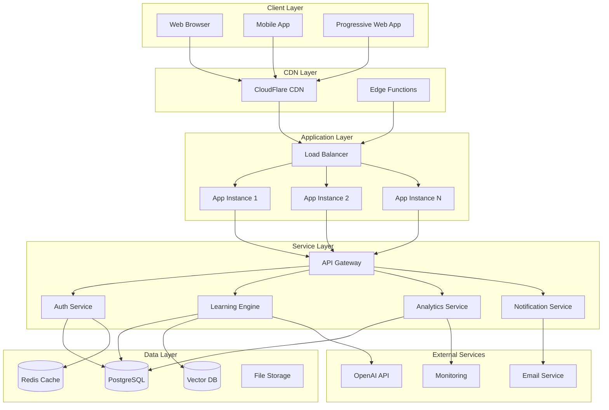

### Core Principles

1. **Scalability**: Horizontal scaling through stateless design
2. **Security**: Multi-layered security with defense in depth
3. **Performance**: Edge computing and intelligent caching
4. **Reliability**: Fault tolerance and graceful degradation
5. **Maintainability**: Clean architecture and separation of concerns
6. **Observability**: Comprehensive monitoring and logging

## Architecture Layers

### 1. Presentation Layer

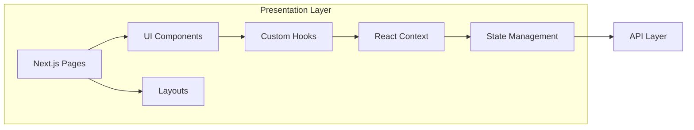

**Responsibilities:**
- User interface rendering
- User interaction handling
- Client-side state management
- Progressive Web App functionality
- Responsive design implementation

**Technologies:**
- React 18 with Concurrent Features
- Next.js 15 App Router
- Tailwind CSS v4
- Framer Motion for animations
- React Hook Form for form management

### 2. API Layer

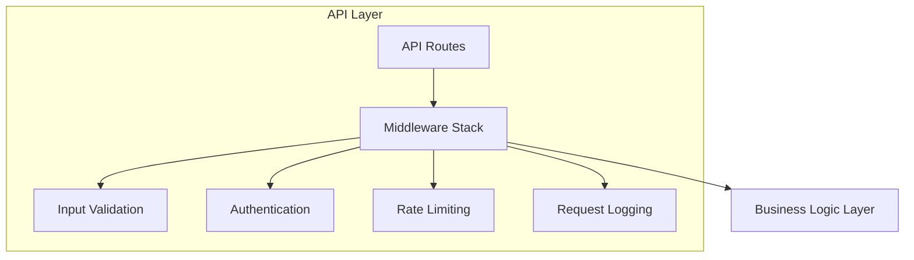

**Responsibilities:**
- HTTP request/response handling
- API endpoint routing
- Request validation and sanitization
- Authentication and authorization
- Rate limiting and security controls
- Request/response logging

**Technologies:**
- Next.js API Routes
- Zod for schema validation
- JWT for authentication
- Custom middleware for security
- OpenAPI/Swagger for documentation

### 3. Business Logic Layer

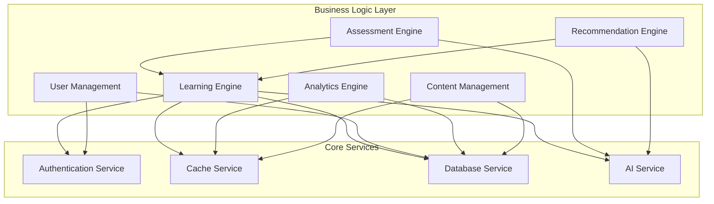

**Responsibilities:**
- Core business logic implementation
- Learning algorithm execution
- User behavior analysis
- Content personalization
- Performance analytics
- Recommendation generation

### 4. Data Access Layer

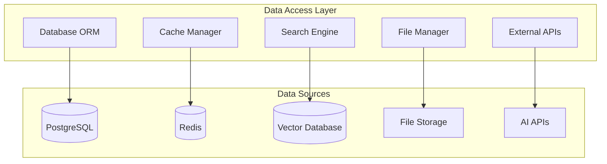

**Responsibilities:**
- Database connection management
- Query optimization
- Caching strategies
- File storage operations
- External API integrations

## Component Architecture

### Learning Engine Components

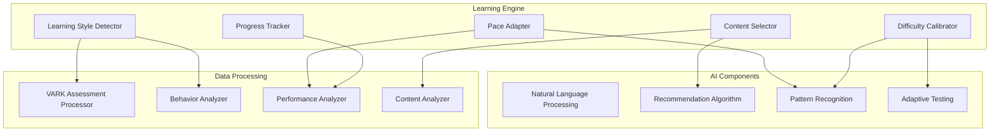

### Authentication & Authorization

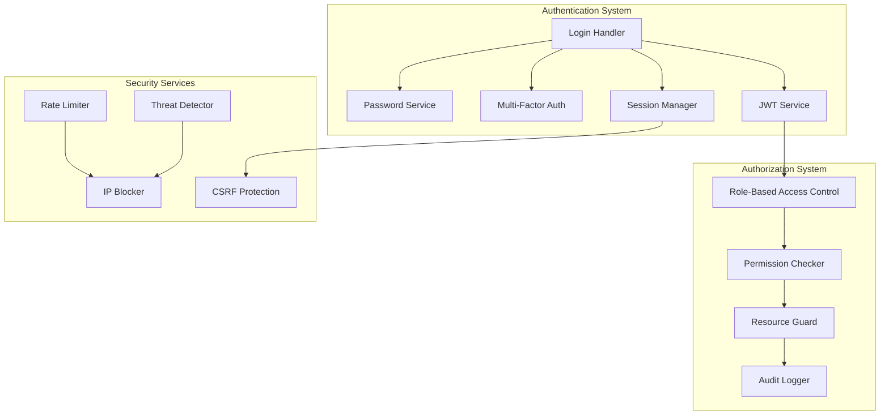

## Data Architecture

### Database Schema Design

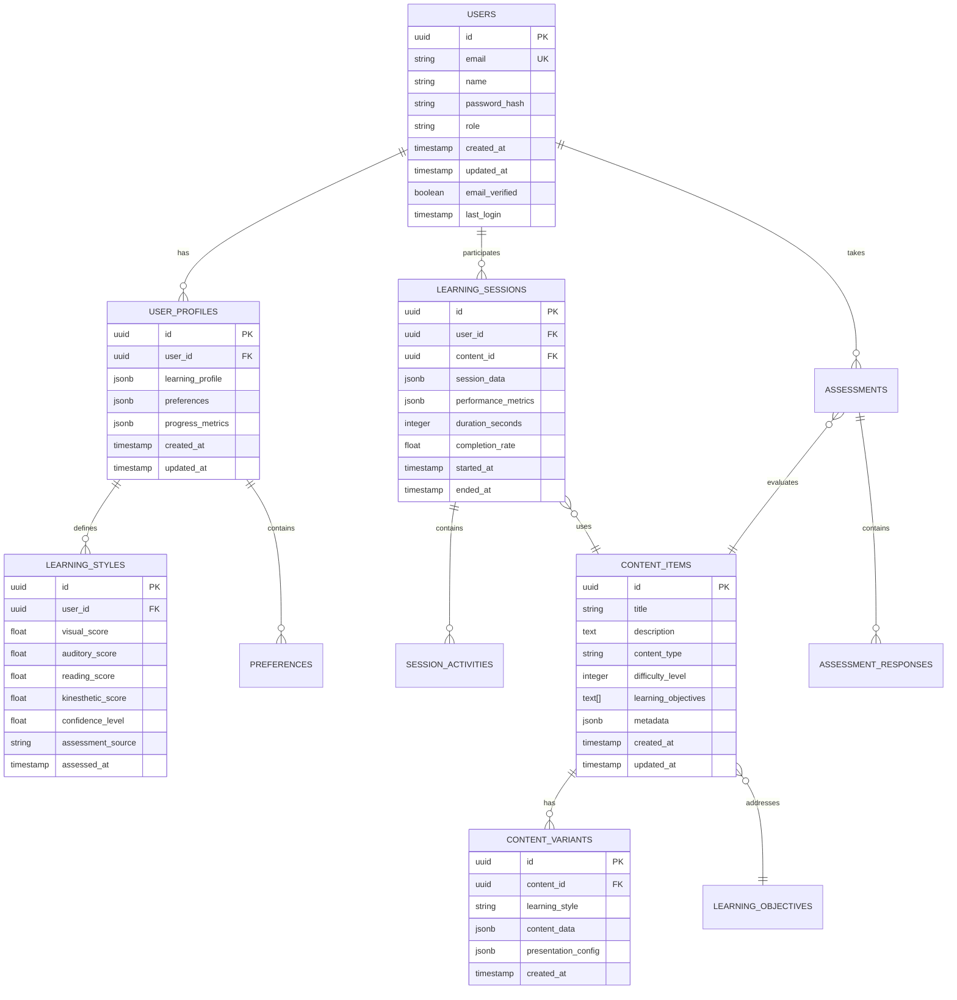

### Data Flow Architecture

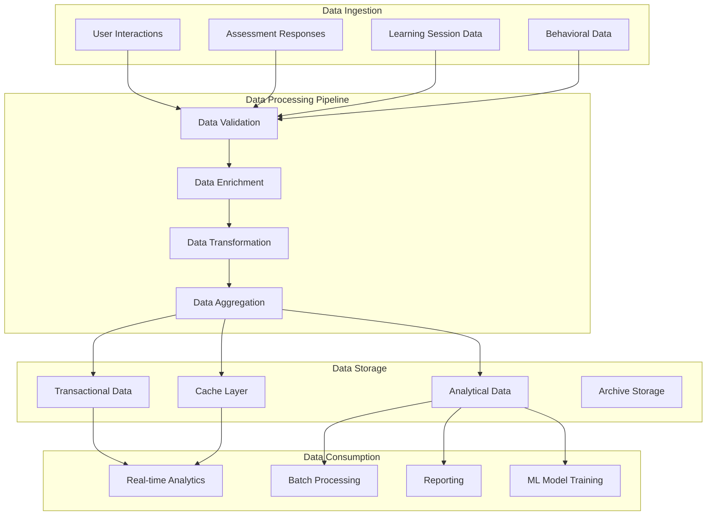

### Caching Strategy

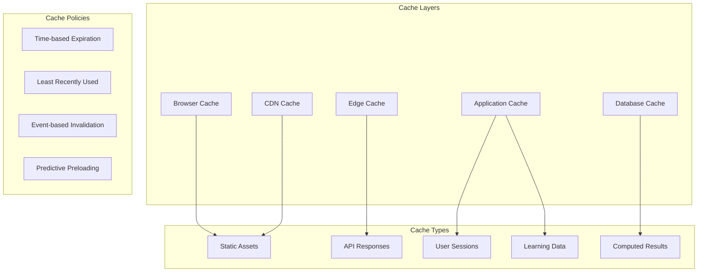

## Security Architecture

### Multi-Layer Security Model

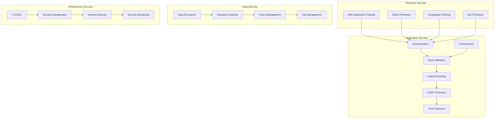

### Authentication Flow

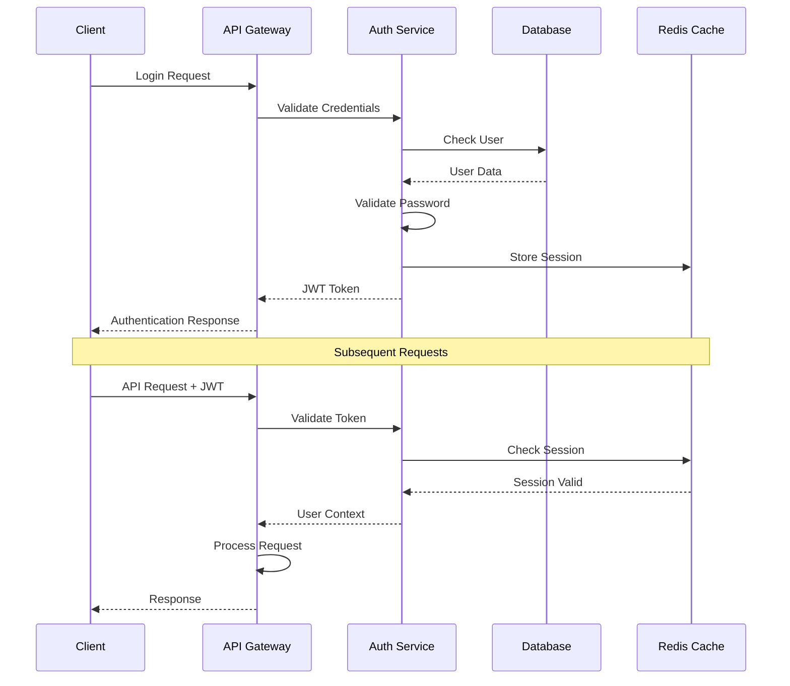

## API Architecture

### RESTful API Design

```mermaid
graph TB
    subgraph "API Gateway"
        ROUTER[Request Router]
        MIDDLEWARE[Middleware Stack]
        VERSIONING[API Versioning]
        DOCS[Documentation]
    end
    
    subgraph "Resource Endpoints"
        USERS[/api/users]
        LEARNING[/api/learning]
        ANALYTICS[/api/analytics]
        CONTENT[/api/content]
        ASSESSMENTS[/api/assessments]
    end
    
    subgraph "Cross-Cutting Concerns"
        AUTH[Authentication]
        RATE_LIMIT[Rate Limiting]
        VALIDATION[Input Validation]
        LOGGING[Request Logging]
        MONITORING[API Monitoring]
    end
    
    ROUTER --> USERS
    ROUTER --> LEARNING
    ROUTER --> ANALYTICS
    ROUTER --> CONTENT
    ROUTER --> ASSESSMENTS
    
    MIDDLEWARE --> AUTH
    MIDDLEWARE --> RATE_LIMIT
    MIDDLEWARE --> VALIDATION
    MIDDLEWARE --> LOGGING
    MIDDLEWARE --> MONITORING
```

### API Response Structure

```typescript
// Success Response
interface ApiSuccessResponse<T> {
  success: true;
  data: T;
  message?: string;
  metadata?: {
    pagination?: PaginationInfo;
    timestamp: string;
    requestId: string;
  };
}

// Error Response
interface ApiErrorResponse {
  success: false;
  error: string;
  message: string;
  details?: ValidationError[];
  timestamp: string;
  requestId: string;
  statusCode: number;
}

// Pagination Info
interface PaginationInfo {
  page: number;
  limit: number;
  total: number;
  totalPages: number;
  hasNext: boolean;
  hasPrev: boolean;
}
```

## Frontend Architecture

### Component Hierarchy

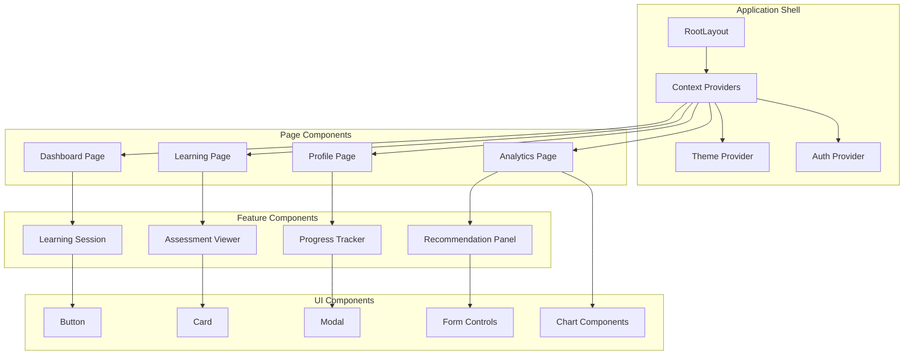

### State Management Architecture

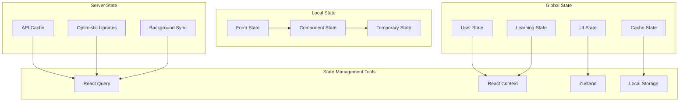

## Learning Engine Architecture

### Adaptive Learning Pipeline

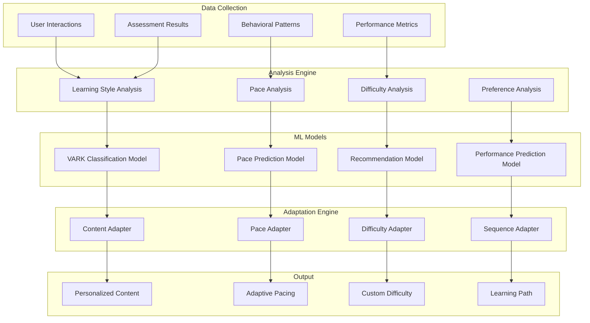

### VARK Learning Style Detection

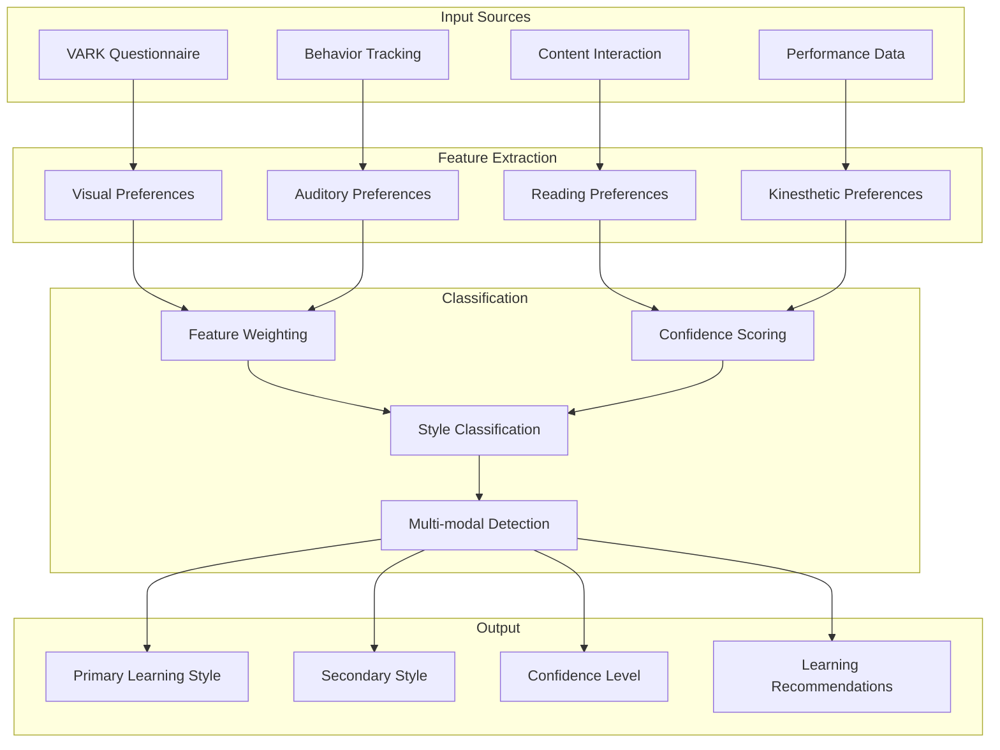

## Deployment Architecture

### Multi-Environment Setup

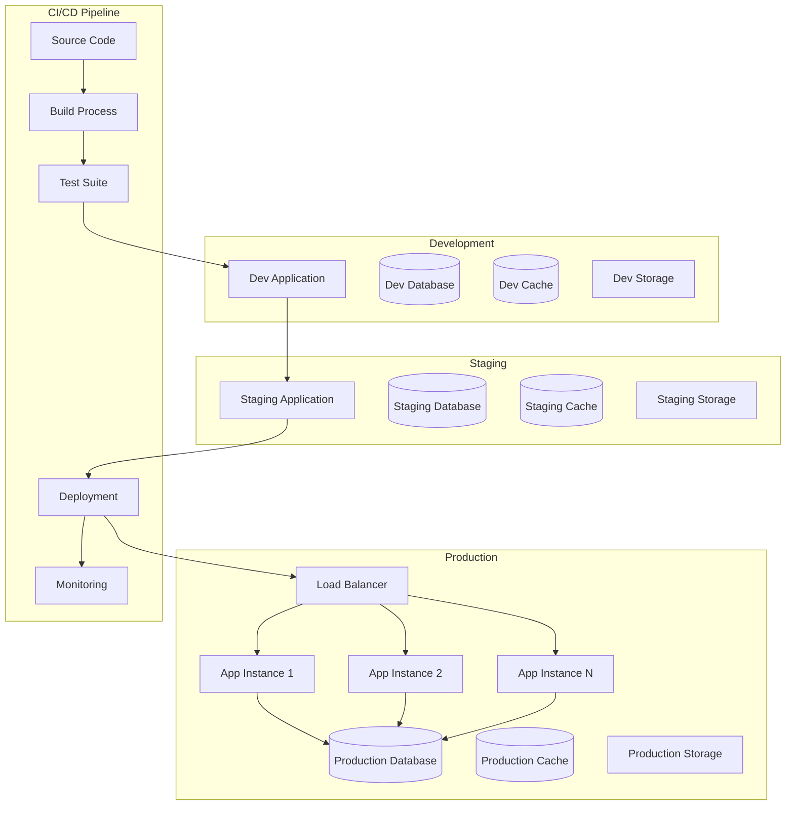

### Container Architecture

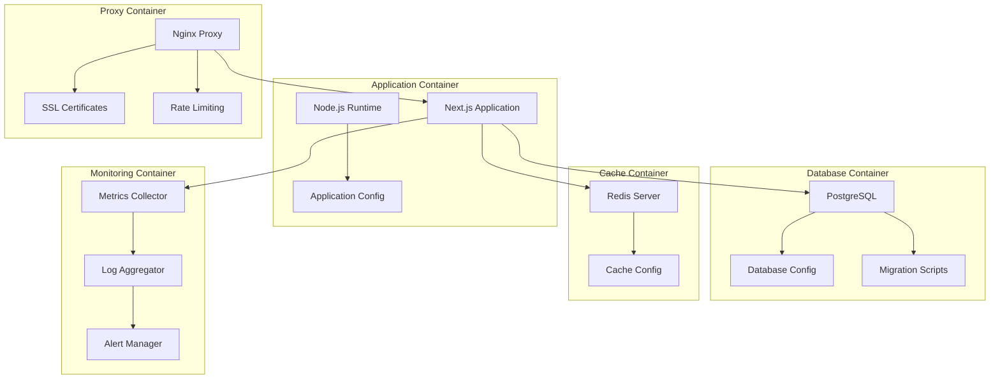

## Monitoring and Observability

### Observability Stack

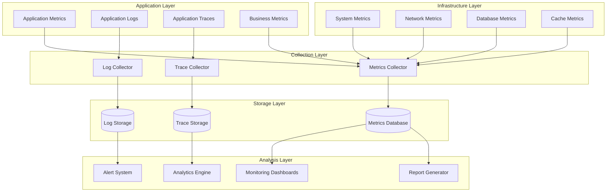

### Performance Monitoring

```mermaid
graph TB
    subgraph "Client-Side Monitoring"
        WEB_VITALS[Core Web Vitals]
        USER_INTERACTIONS[User Interactions]
        ERROR_TRACKING[Error Tracking]
        PERFORMANCE_API[Performance API]
    end
    
    subgraph "Server-Side Monitoring"
        API_PERFORMANCE[API Performance]
        DATABASE_PERFORMANCE[Database Performance]
        CACHE_PERFORMANCE[Cache Performance]
        SYSTEM_RESOURCES[System Resources]
    end
    
    subgraph "Business Monitoring"
        LEARNING_METRICS[Learning Metrics]
        USER_ENGAGEMENT[User Engagement]
        FEATURE_USAGE[Feature Usage]
        CONVERSION_RATES[Conversion Rates]
    end
    
    subgraph "Alerting System"
        THRESHOLD_ALERTS[Threshold Alerts]
        ANOMALY_DETECTION[Anomaly Detection]
        ESCALATION_RULES[Escalation Rules]
        NOTIFICATION_CHANNELS[Notification Channels]
    end
    
    WEB_VITALS --> THRESHOLD_ALERTS
    API_PERFORMANCE --> THRESHOLD_ALERTS
    LEARNING_METRICS --> ANOMALY_DETECTION
    
    THRESHOLD_ALERTS --> ESCALATION_RULES
    ANOMALY_DETECTION --> ESCALATION_RULES
    ESCALATION_RULES --> NOTIFICATION_CHANNELS
```

## Scalability Considerations

### Horizontal Scaling Strategy

```mermaid
graph TB
    subgraph "Load Distribution"
        LOAD_BALANCER[Application Load Balancer]
        AUTO_SCALING[Auto Scaling Groups]
        HEALTH_CHECKS[Health Checks]
    end
    
    subgraph "Application Tier"
        APP_CLUSTER[Application Cluster]
        STATELESS_DESIGN[Stateless Design]
        SESSION_STORE[External Session Store]
    end
    
    subgraph "Data Tier"
        READ_REPLICAS[Database Read Replicas]
        WRITE_MASTER[Database Write Master]
        CACHE_CLUSTER[Distributed Cache]
        SHARDING[Database Sharding]
    end
    
    subgraph "Static Assets"
        CDN[Content Delivery Network]
        EDGE_LOCATIONS[Edge Locations]
        ASSET_OPTIMIZATION[Asset Optimization]
    end
    
    LOAD_BALANCER --> AUTO_SCALING
    AUTO_SCALING --> APP_CLUSTER
    HEALTH_CHECKS --> APP_CLUSTER
    
    APP_CLUSTER --> STATELESS_DESIGN
    STATELESS_DESIGN --> SESSION_STORE
    
    APP_CLUSTER --> READ_REPLICAS
    APP_CLUSTER --> WRITE_MASTER
    APP_CLUSTER --> CACHE_CLUSTER
    WRITE_MASTER --> SHARDING
    
    CDN --> EDGE_LOCATIONS
    EDGE_LOCATIONS --> ASSET_OPTIMIZATION
```

### Performance Optimization

```mermaid
graph TB
    subgraph "Frontend Optimization"
        CODE_SPLITTING[Code Splitting]
        LAZY_LOADING[Lazy Loading]
        IMAGE_OPTIMIZATION[Image Optimization]
        BUNDLE_OPTIMIZATION[Bundle Optimization]
    end
    
    subgraph "Backend Optimization"
        QUERY_OPTIMIZATION[Query Optimization]
        CACHING_STRATEGY[Caching Strategy]
        CONNECTION_POOLING[Connection Pooling]
        ASYNC_PROCESSING[Async Processing]
    end
    
    subgraph "Database Optimization"
        INDEX_OPTIMIZATION[Index Optimization]
        QUERY_CACHING[Query Caching]
        PARTITION_STRATEGY[Partition Strategy]
        ARCHIVAL_STRATEGY[Data Archival]
    end
    
    subgraph "Network Optimization"
        COMPRESSION[Response Compression]
        HTTP2[HTTP/2 Protocol]
        PREFETCHING[Resource Prefetching]
        PRELOADING[Critical Resource Preloading]
    end
    
    CODE_SPLITTING --> LAZY_LOADING
    LAZY_LOADING --> IMAGE_OPTIMIZATION
    IMAGE_OPTIMIZATION --> BUNDLE_OPTIMIZATION
    
    QUERY_OPTIMIZATION --> CACHING_STRATEGY
    CACHING_STRATEGY --> CONNECTION_POOLING
    CONNECTION_POOLING --> ASYNC_PROCESSING
    
    INDEX_OPTIMIZATION --> QUERY_CACHING
    QUERY_CACHING --> PARTITION_STRATEGY
    PARTITION_STRATEGY --> ARCHIVAL_STRATEGY
    
    COMPRESSION --> HTTP2
    HTTP2 --> PREFETCHING
    PREFETCHING --> PRELOADING
```

## Future Architecture Evolution

### Planned Enhancements

```mermaid
graph TB
    subgraph "Phase 1: Foundation Enhancement"
        MICROSERVICES[Microservices Migration]
        EVENT_SOURCING[Event Sourcing]
        CQRS[CQRS Pattern]
        API_GATEWAY[Enhanced API Gateway]
    end
    
    subgraph "Phase 2: AI Enhancement"
        ML_PIPELINE[ML Pipeline]
        REAL_TIME_INFERENCE[Real-time Inference]
        MODEL_SERVING[Model Serving]
        FEATURE_STORE[Feature Store]
    end
    
    subgraph "Phase 3: Advanced Features"
        REAL_TIME_COLLABORATION[Real-time Collaboration]
        AR_VR_SUPPORT[AR/VR Support]
        BLOCKCHAIN_INTEGRATION[Blockchain Integration]
        IOT_INTEGRATION[IoT Integration]
    end
    
    subgraph "Phase 4: Scale & Performance"
        EDGE_COMPUTING[Edge Computing]
        SERVERLESS_FUNCTIONS[Serverless Functions]
        GLOBAL_DISTRIBUTION[Global Distribution]
        QUANTUM_READY[Quantum-Ready Security]
    end
    
    MICROSERVICES --> ML_PIPELINE
    EVENT_SOURCING --> REAL_TIME_INFERENCE
    CQRS --> MODEL_SERVING
    API_GATEWAY --> FEATURE_STORE
    
    ML_PIPELINE --> REAL_TIME_COLLABORATION
    REAL_TIME_INFERENCE --> AR_VR_SUPPORT
    MODEL_SERVING --> BLOCKCHAIN_INTEGRATION
    FEATURE_STORE --> IOT_INTEGRATION
    
    REAL_TIME_COLLABORATION --> EDGE_COMPUTING
    AR_VR_SUPPORT --> SERVERLESS_FUNCTIONS
    BLOCKCHAIN_INTEGRATION --> GLOBAL_DISTRIBUTION
    IOT_INTEGRATION --> QUANTUM_READY
```

### Technology Roadmap

| Phase | Timeline | Key Technologies | Goals |
|-------|----------|------------------|-------|
| Phase 1 | Q1-Q2 2024 | Next.js 15, PostgreSQL 15, Redis 7 | Foundation stability |
| Phase 2 | Q3-Q4 2024 | TensorFlow.js, WebAssembly, ML Models | AI enhancement |
| Phase 3 | Q1-Q2 2025 | WebRTC, WebXR, Blockchain APIs | Advanced features |
| Phase 4 | Q3-Q4 2025 | Edge Computing, Quantum Security | Global scale |

This detailed architecture documentation provides a comprehensive view of the Learning Assistant system design, from high-level system architecture to specific implementation details. The modular design ensures scalability, maintainability, and future extensibility while maintaining security and performance standards.