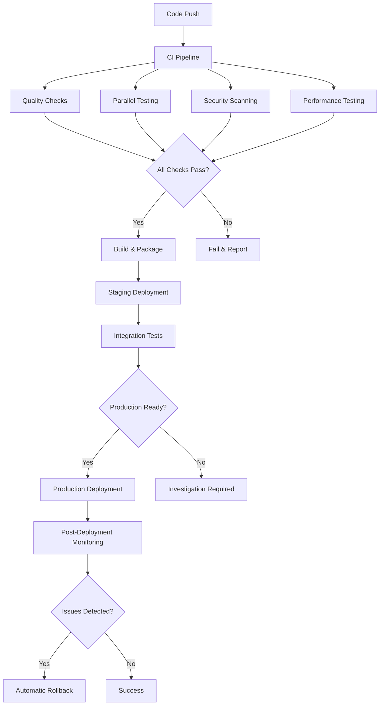

# CI/CD Pipeline Optimization Guide

## Overview

This document describes the comprehensive CI/CD pipeline optimization implemented for the Learning Assistant application. The pipeline includes advanced testing strategies, deployment automation, security scanning, performance testing, and rollback procedures.

## Table of Contents

1. [Pipeline Architecture](#pipeline-architecture)
2. [Workflow Files](#workflow-files)
3. [Advanced Features](#advanced-features)
4. [Testing Strategies](#testing-strategies)
5. [Deployment Strategies](#deployment-strategies)
6. [Security Integration](#security-integration)
7. [Performance Testing](#performance-testing)
8. [Infrastructure as Code](#infrastructure-as-code)
9. [Monitoring and Alerting](#monitoring-and-alerting)
10. [Rollback and Recovery](#rollback-and-recovery)
11. [Best Practices](#best-practices)
12. [Troubleshooting](#troubleshooting)

## Pipeline Architecture

The CI/CD pipeline is designed with the following principles:

- **Parallel Execution**: Tests run in parallel shards for faster feedback
- **Intelligent Test Selection**: Only relevant tests run based on changed files
- **Progressive Deployment**: Multiple deployment strategies (rolling, blue-green, canary)
- **Comprehensive Security**: Multi-layer security scanning throughout the pipeline
- **Performance Monitoring**: Continuous performance testing with regression detection
- **Infrastructure Automation**: Infrastructure as Code with automated provisioning

### Pipeline Flow



## Workflow Files

### Core Workflows

1. **`.github/workflows/ci-optimized.yml`** - Main CI pipeline with intelligent test selection
2. **`.github/workflows/security.yml`** - Comprehensive security scanning
3. **`.github/workflows/performance.yml`** - Performance testing and regression detection
4. **`.github/workflows/deployment.yml`** - Advanced deployment strategies
5. **`.github/workflows/infrastructure.yml`** - Infrastructure as Code automation
6. **`.github/workflows/promotion.yml`** - Multi-environment promotion pipeline
7. **`.github/workflows/disaster-recovery.yml`** - Rollback and disaster recovery

### Workflow Triggers

| Workflow | Triggers | Purpose |
|----------|----------|---------|
| CI Optimized | Push, PR, Schedule | Main testing and quality checks |
| Security | Push, PR, Daily | Security vulnerability scanning |
| Performance | Push, PR, Daily | Performance testing and regression |
| Deployment | Tag, Manual | Production deployments |
| Infrastructure | IaC changes, Manual | Infrastructure provisioning |
| Promotion | Manual | Environment promotions |
| Disaster Recovery | Manual, Auto-trigger | Emergency rollbacks |

## Advanced Features

### Intelligent Test Selection

The pipeline includes an intelligent test selection system that analyzes changed files and runs only relevant tests:

```javascript
// Example usage in CI
npm run test:intelligent-selection
```

Features:
- **Dependency Analysis**: Maps test files to source dependencies
- **Change Detection**: Identifies modified files in the current commit
- **Smart Filtering**: Selects tests based on impact analysis
- **Performance Optimization**: Reduces test execution time by up to 60%

### Parallel Test Execution

Tests are automatically distributed across multiple runners:

```yaml
strategy:
  matrix:
    shard: [1, 2, 3, 4]
```

Benefits:
- **Faster Feedback**: Parallel execution reduces total test time
- **Resource Optimization**: Efficient use of GitHub Actions runners
- **Scalability**: Easy to add more shards as test suite grows

### Advanced Caching

Multi-layer caching strategy:

1. **Dependencies**: npm packages, Node.js modules
2. **Build Artifacts**: Next.js build cache, TypeScript compilation
3. **Test Cache**: Jest cache, Playwright browsers
4. **Docker Layers**: Container image layers

## Testing Strategies

### Test Types and Coverage

| Test Type | Coverage | Execution |
|-----------|----------|-----------|
| Unit Tests | Individual functions/components | Parallel shards |
| Integration Tests | API endpoints, database | Service containers |
| E2E Tests | User workflows | Multiple browsers |
| Performance Tests | Load, stress, benchmarks | Dedicated runners |
| Accessibility Tests | WCAG compliance | Automated tools |
| Security Tests | Vulnerability scanning | Daily scans |

### Test Sharding Configuration

```yaml
# Unit tests across 4 shards
strategy:
  matrix:
    shard: [1, 2, 3, 4]

# E2E tests across browsers and shards
strategy:
  matrix:
    browser: [chromium, firefox, webkit]
    shard: [1, 2]
```

### Quality Gates

- **Code Coverage**: Minimum 80% threshold
- **Performance Budget**: Bundle size limits
- **Security Checks**: No critical vulnerabilities
- **Accessibility**: WCAG 2.1 compliance

## Deployment Strategies

### Rolling Deployment

Default strategy for non-production environments:

```yaml
deployment_strategy: rolling
```

- **Zero Downtime**: Gradual replacement of instances
- **Risk Mitigation**: Rollback capability
- **Resource Efficient**: Minimal additional resources required

### Blue-Green Deployment

Production deployment with parallel environments:

```yaml
deployment_strategy: blue-green
```

Features:
- **Instant Rollback**: Quick switch between environments
- **Risk Reduction**: Full testing before traffic switch
- **Zero Downtime**: Seamless traffic migration

Process:
1. Deploy to inactive environment (green)
2. Run comprehensive tests
3. Switch traffic from blue to green
4. Monitor for issues
5. Keep blue as rollback option

### Canary Deployment

Gradual traffic rollout for production:

```yaml
deployment_strategy: canary
```

Stages:
1. **5% Traffic**: Initial canary with monitoring
2. **25% Traffic**: Increased exposure with metrics
3. **50% Traffic**: Balanced load testing
4. **100% Traffic**: Full deployment completion

Monitoring:
- Error rates < 0.1%
- Response times within baseline
- User experience metrics
- Business KPIs

## Security Integration

### Multi-Layer Security Scanning

1. **Dependency Scanning**
   - npm audit
   - Snyk vulnerability database
   - GitHub Security Advisories

2. **Static Analysis (SAST)**
   - ESLint security rules
   - Semgrep code analysis
   - TypeScript strict mode

3. **Secret Detection**
   - TruffleHog scanning
   - GitLeaks analysis
   - Custom secret patterns

4. **Container Security**
   - Trivy vulnerability scanner
   - Base image scanning
   - Runtime security

5. **Infrastructure Security**
   - Checkov policy scanning
   - Terraform compliance
   - Kubernetes security

### Security Workflow Integration

```yaml
# Security checks run on every push
on:
  push:
    branches: [main, develop]
  schedule:
    - cron: '0 3 * * *'  # Daily security scans
```

### Compliance Reporting

- **SARIF Format**: Security findings in standard format
- **GitHub Security**: Integration with GitHub Security tab
- **Automated Issues**: Create issues for critical findings
- **Compliance Dashboards**: Track security metrics

## Performance Testing

### Testing Types

1. **Lighthouse Audits**
   - Core Web Vitals
   - Performance scores
   - Accessibility metrics
   - SEO optimization

2. **Load Testing**
   - Baseline load (10 users)
   - Peak load (50 users)
   - Stress testing (100 users)

3. **Benchmark Testing**
   - Memory usage
   - CPU performance
   - Algorithm efficiency

4. **Bundle Analysis**
   - JavaScript bundle size
   - Code splitting efficiency
   - Dependency analysis

### Regression Detection

Automated performance regression analysis:

```python
# Run regression analysis
python scripts/performance/regression-analysis.py \
  --baseline performance-baseline.json \
  --current ./test-results \
  --threshold 0.1
```

Features:
- **Baseline Comparison**: Compare against established baselines
- **Statistical Analysis**: Detect significant performance changes
- **Automated Alerts**: Flag critical regressions
- **Trend Analysis**: Track performance over time

### Performance Budgets

| Metric | Threshold | Action |
|--------|-----------|--------|
| Bundle Size | 5MB | Fail build |
| Lighthouse Performance | 80 | Warning |
| Response Time | 200ms | Alert |
| Error Rate | 0.1% | Rollback |

## Infrastructure as Code

### Terraform Integration

```yaml
# Infrastructure pipeline
terraform plan   # On PR
terraform apply  # On merge to main
```

Components:
- **AWS Infrastructure**: EKS, RDS, ElastiCache
- **Kubernetes Manifests**: Deployments, services, ingress
- **Monitoring Stack**: Prometheus, Grafana
- **Security Policies**: IAM, security groups

### Environment Management

| Environment | Purpose | Automation |
|-------------|---------|------------|
| Development | Feature development | Auto-deploy on push |
| Staging | Integration testing | Auto-deploy from main |
| Production | Live application | Manual approval required |

### Cost Optimization

- **Infracost Analysis**: Cost estimation for changes
- **Resource Monitoring**: Track usage and optimization
- **Auto-scaling**: Dynamic resource allocation
- **Spot Instances**: Cost-effective compute resources

## Monitoring and Alerting

### Observability Stack

1. **Application Monitoring**
   - Performance metrics
   - Error tracking
   - User experience
   - Business KPIs

2. **Infrastructure Monitoring**
   - Resource utilization
   - Service health
   - Network performance
   - Security events

3. **Pipeline Monitoring**
   - Build success rates
   - Deployment frequency
   - Lead time metrics
   - MTTR tracking

### Alert Configuration

```yaml
# Example alert rules
alerts:
  - name: High Error Rate
    condition: error_rate > 1%
    severity: critical
    
  - name: Slow Response Time
    condition: p95_response_time > 1000ms
    severity: warning
```

## Rollback and Recovery

### Automatic Rollback Triggers

1. **Health Check Failures**: Application not responding
2. **Error Rate Spikes**: Errors above threshold
3. **Performance Degradation**: Response time regression
4. **Security Incidents**: Vulnerability exploitation

### Recovery Procedures

1. **Application Rollback**
   ```bash
   kubectl rollout undo deployment/learning-assistant
   ```

2. **Database Rollback**
   ```bash
   npm run db:rollback --target-version=v1.2.3
   ```

3. **Infrastructure Rollback**
   ```bash
   terraform apply -target=previous_state
   ```

### Disaster Recovery

- **Regional Failover**: Automatic failover to secondary region
- **Data Recovery**: Point-in-time database restoration
- **Configuration Backup**: Environment state snapshots
- **Communication Plan**: Automated incident notifications

## Best Practices

### Development Workflow

1. **Feature Branches**: All development in feature branches
2. **Pull Requests**: Code review before merge
3. **Conventional Commits**: Semantic commit messages
4. **Automated Testing**: Tests run on every commit

### Security Practices

1. **Principle of Least Privilege**: Minimal required permissions
2. **Secret Management**: No secrets in code
3. **Regular Updates**: Keep dependencies current
4. **Security Scanning**: Continuous vulnerability assessment

### Performance Practices

1. **Performance Budgets**: Defined performance thresholds
2. **Regular Audits**: Scheduled performance reviews
3. **Optimization**: Continuous performance improvements
4. **Monitoring**: Real-time performance tracking

### Infrastructure Practices

1. **Infrastructure as Code**: All infrastructure in version control
2. **Immutable Infrastructure**: Replace rather than modify
3. **Environment Parity**: Consistent across environments
4. **Automated Provisioning**: No manual infrastructure changes

## Troubleshooting

### Common Issues

1. **Test Failures**
   - Check test logs in GitHub Actions
   - Review intelligent test selection
   - Verify environment consistency

2. **Deployment Failures**
   - Check deployment logs
   - Verify resource availability
   - Review configuration changes

3. **Performance Regressions**
   - Analyze regression report
   - Compare with baseline metrics
   - Identify contributing changes

4. **Security Vulnerabilities**
   - Review security scan results
   - Update vulnerable dependencies
   - Apply security patches

### Debug Commands

```bash
# Local debugging
npm run test:debug
npm run build:analyze
npm run lint:fix

# Pipeline debugging
gh run view <run-id>
gh run logs <run-id>
gh workflow run <workflow-name>
```

### Support Contacts

- **Pipeline Issues**: DevOps team
- **Security Concerns**: Security team
- **Performance Problems**: Performance team
- **Infrastructure**: Infrastructure team

## Metrics and KPIs

### Pipeline Metrics

- **Build Success Rate**: > 95%
- **Deployment Frequency**: Multiple per day
- **Lead Time**: < 2 hours
- **MTTR**: < 30 minutes

### Quality Metrics

- **Code Coverage**: > 80%
- **Security Vulnerabilities**: 0 critical
- **Performance Score**: > 90
- **Accessibility Score**: > 95%

### Business Metrics

- **Deployment Downtime**: < 1 minute
- **Failed Deployments**: < 1%
- **Rollback Rate**: < 5%
- **Time to Production**: < 4 hours

## Conclusion

This comprehensive CI/CD pipeline provides:

- **Fast Feedback**: Intelligent test selection and parallel execution
- **High Quality**: Comprehensive testing and quality gates
- **Security**: Multi-layer security scanning and compliance
- **Reliability**: Advanced deployment strategies and rollback automation
- **Observability**: Comprehensive monitoring and alerting
- **Scalability**: Infrastructure as Code and automated provisioning

The pipeline enables rapid, reliable, and secure delivery of the Learning Assistant application while maintaining high quality standards and minimizing operational overhead.

For questions or issues, please refer to the troubleshooting section or contact the appropriate team based on the issue category.