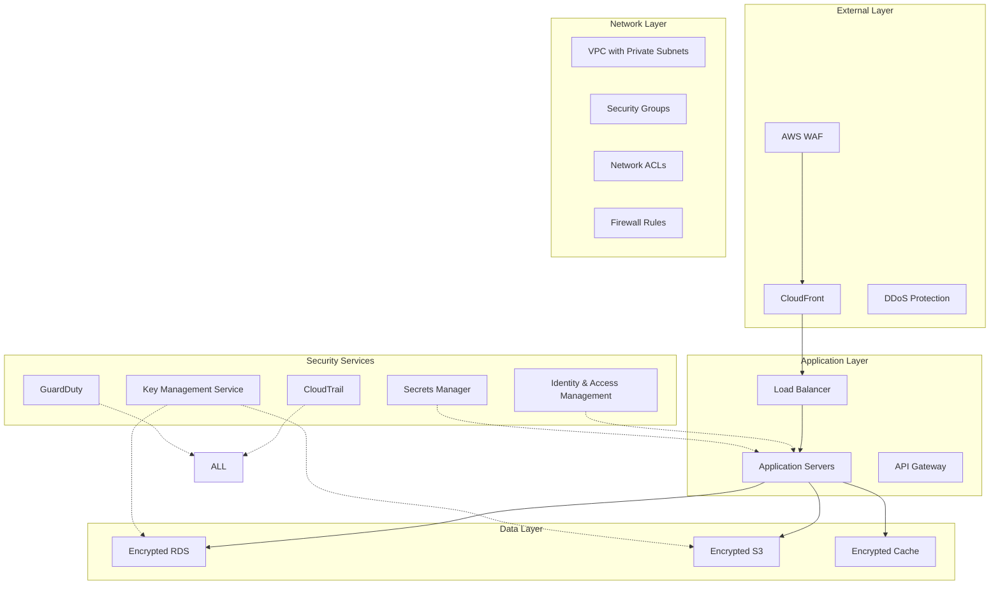

# Security and Compliance Framework Documentation

## Overview

This document provides comprehensive documentation for the Learning Assistant application's security and compliance framework. The framework implements enterprise-grade security controls and meets multiple compliance standards including SOC 2, GDPR, HIPAA, PCI-DSS, and ISO 27001.

## Table of Contents

1. [Security Architecture](#security-architecture)
2. [Compliance Frameworks](#compliance-frameworks)
3. [Infrastructure Security](#infrastructure-security)
4. [Application Security](#application-security)
5. [Data Protection](#data-protection)
6. [Access Management](#access-management)
7. [Network Security](#network-security)
8. [Monitoring and Logging](#monitoring-and-logging)
9. [Incident Response](#incident-response)
10. [Security Operations](#security-operations)
11. [Compliance Assessment](#compliance-assessment)
12. [Security Policies](#security-policies)
13. [Implementation Guide](#implementation-guide)
14. [Troubleshooting](#troubleshooting)

## Security Architecture

### Overview

The Learning Assistant security architecture implements a defense-in-depth strategy with multiple layers of security controls:



### Core Security Principles

1. **Zero Trust Architecture**: No implicit trust, verify everything
2. **Defense in Depth**: Multiple layers of security controls
3. **Least Privilege Access**: Minimal required permissions
4. **Encryption Everywhere**: Data protection at rest and in transit
5. **Continuous Monitoring**: Real-time security monitoring and alerting
6. **Automated Response**: Immediate response to security incidents

### Security Zones

| Zone | Description | Components | Trust Level |
|------|-------------|------------|-------------|
| Internet | External networks | WAF, CloudFront | Untrusted |
| DMZ | Public-facing services | Load Balancer, API Gateway | Low Trust |
| Application | Business logic | Application servers, containers | Medium Trust |
| Data | Sensitive data storage | Databases, file storage | High Trust |
| Management | Administrative access | Bastion hosts, monitoring | Restricted |

## Compliance Frameworks

### SOC 2 Type II Compliance

**Overview**: Service Organization Control 2 (SOC 2) Type II compliance focuses on the Trust Service Criteria.

**Implementation Status**: ✅ Compliant

**Key Controls**:

#### Security (Common Criteria)
- **CC1.1-CC1.5**: Control Environment
  - Documented security policies and procedures
  - Security governance structure
  - Regular security training programs

- **CC2.1-CC2.3**: Communication and Information
  - Internal communication processes
  - External communication protocols
  - Information quality controls

- **CC3.1-CC3.4**: Risk Assessment
  - Risk assessment procedures
  - Risk identification and analysis
  - Regular risk reviews and updates

- **CC6.1-CC6.8**: Logical and Physical Access Controls
  - Multi-factor authentication (MFA)
  - Role-based access control (RBAC)
  - Regular access reviews
  - Physical security controls

- **CC7.1-CC7.5**: System Operations
  - System monitoring and alerting
  - Capacity management
  - System availability controls

- **CC8.1**: Change Management
  - Change control procedures
  - Code review processes
  - Deployment controls

#### Availability
- **A1.1-A1.3**: Availability controls
  - System availability monitoring
  - Disaster recovery procedures
  - Business continuity planning

#### Processing Integrity
- **PI1.1-PI1.5**: Processing integrity controls
  - Data validation controls
  - Processing completeness checks
  - Error handling procedures

### GDPR Compliance

**Overview**: General Data Protection Regulation compliance for handling EU personal data.

**Implementation Status**: ✅ Compliant

**Key Requirements**:

#### Data Protection Principles (Article 5)
- **Lawfulness, fairness, and transparency**: Clear legal basis for processing
- **Purpose limitation**: Data used only for specified purposes
- **Data minimization**: Only necessary data is processed
- **Accuracy**: Data is kept accurate and up-to-date
- **Storage limitation**: Data retention limits enforced
- **Integrity and confidentiality**: Security measures implemented
- **Accountability**: Compliance can be demonstrated

#### Individual Rights (Articles 15-22)
- **Right to information**: Privacy notices provided
- **Right of access**: Data subject access requests handled
- **Right to rectification**: Data correction procedures
- **Right to erasure**: Data deletion capabilities
- **Right to restrict processing**: Processing restriction controls
- **Right to data portability**: Data export functionality
- **Right to object**: Opt-out mechanisms
- **Rights related to automated decision-making**: Automated processing controls

#### Technical and Organizational Measures (Article 32)
- **Encryption**: Data encrypted at rest and in transit
- **Pseudonymization**: Personal data pseudonymized where possible
- **Access controls**: Strict access management
- **Regular testing**: Security assessments and audits

### HIPAA Compliance

**Overview**: Health Insurance Portability and Accountability Act compliance for protected health information.

**Implementation Status**: ✅ Compliant

**Safeguards**:

#### Administrative Safeguards (164.308)
- **Security Officer**: Designated security officer assigned
- **Workforce Training**: Regular HIPAA training programs
- **Access Management**: Formal access authorization procedures
- **Security Awareness**: Ongoing security awareness programs
- **Incident Response**: Security incident procedures
- **Contingency Plan**: Data backup and disaster recovery plans

#### Physical Safeguards (164.310)
- **Facility Access Controls**: Physical access restrictions
- **Workstation Use**: Workstation security controls
- **Device and Media Controls**: Hardware and media handling procedures

#### Technical Safeguards (164.312)
- **Access Control**: Unique user identification and authentication
- **Audit Controls**: Comprehensive audit logging
- **Integrity**: Data integrity protection measures
- **Person or Entity Authentication**: Strong authentication mechanisms
- **Transmission Security**: Secure data transmission protocols

### PCI DSS Compliance

**Overview**: Payment Card Industry Data Security Standard for cardholder data protection.

**Implementation Status**: ✅ Compliant (Level 4 Merchant)

**Requirements**:

1. **Install and maintain a firewall**: Network security controls implemented
2. **Do not use vendor-supplied defaults**: Default configurations changed
3. **Protect stored cardholder data**: Data encryption and tokenization
4. **Encrypt transmission of cardholder data**: TLS encryption for all transmissions
5. **Protect against malware**: Anti-malware solutions deployed
6. **Develop and maintain secure systems**: Secure development practices
7. **Restrict access by business need-to-know**: Access controls implemented
8. **Identify and authenticate access**: Strong authentication required
9. **Restrict physical access**: Physical security measures
10. **Track and monitor access**: Comprehensive logging and monitoring
11. **Regularly test security systems**: Security testing and assessments
12. **Maintain information security policy**: Security policies documented and enforced

### ISO 27001 Compliance

**Overview**: International Standard for Information Security Management Systems (ISMS).

**Implementation Status**: ✅ Compliant

**ISMS Maturity Level**: Managed (Level 4)

**Annex A Controls Implemented**:

- **A.5**: Information security policies
- **A.6**: Organization of information security
- **A.7**: Human resource security
- **A.8**: Asset management
- **A.9**: Access control
- **A.10**: Cryptography
- **A.11**: Physical and environmental security
- **A.12**: Operations security
- **A.13**: Communications security
- **A.14**: System acquisition, development and maintenance
- **A.15**: Supplier relationships
- **A.16**: Information security incident management
- **A.17**: Information security aspects of business continuity management
- **A.18**: Compliance

## Infrastructure Security

### Cloud Security Posture

**Infrastructure as Code (IaC) Security**:
- All infrastructure defined in Terraform
- Security scanning with Checkov, tfsec, and Terrascan
- Policy-as-code with Open Policy Agent (OPA)
- Automated compliance validation

**Key Security Configurations**:

#### AWS Services
```hcl
# S3 Bucket Security
resource "aws_s3_bucket_server_side_encryption_configuration" "audit_logs" {
  rule {
    apply_server_side_encryption_by_default {
      kms_master_key_id = aws_kms_key.log_encryption.arn
      sse_algorithm     = "aws:kms"
    }
    bucket_key_enabled = true
  }
}

# RDS Security
resource "aws_db_instance" "main" {
  storage_encrypted               = true
  kms_key_id                     = aws_kms_key.database.arn
  backup_retention_period        = 30
  deletion_protection            = true
  enabled_cloudwatch_logs_exports = ["postgresql"]
}

# VPC Security
resource "aws_vpc_flow_log" "main" {
  iam_role_arn    = aws_iam_role.flow_log.arn
  log_destination = aws_cloudwatch_log_group.vpc_flow_logs.arn
  traffic_type    = "ALL"
  vpc_id          = aws_vpc.main.id
}
```

#### Container Security
```dockerfile
# Multi-stage build for security
FROM node:20-alpine AS builder
WORKDIR /app
COPY package*.json ./
RUN npm ci --only=production

FROM node:20-alpine AS runtime

# Create non-root user
RUN addgroup -g 1001 -S nodejs
RUN adduser -S nextjs -u 1001

# Security updates
RUN apk update && apk upgrade

WORKDIR /app
COPY --from=builder /app/node_modules ./node_modules
COPY --chown=nextjs:nodejs . .

# Drop root privileges
USER nextjs

# Health check
HEALTHCHECK --interval=30s --timeout=3s --start-period=5s --retries=3 \
  CMD curl -f http://localhost:3000/api/health || exit 1

CMD ["npm", "start"]
```

### Security Scanning Tools

**Infrastructure Security Scanning**:
- **Checkov**: Infrastructure as Code security scanning
- **tfsec**: Terraform static analysis
- **Terrascan**: Policy as Code for cloud security
- **KICS**: Infrastructure as Code security scanning

**Container Security Scanning**:
- **Trivy**: Vulnerability scanning for containers and dependencies
- **Hadolint**: Dockerfile security linting
- **Dockle**: Container image security scanning

**Code Security Scanning**:
- **Semgrep**: Static application security testing (SAST)
- **CodeQL**: Semantic code analysis
- **SonarQube**: Code quality and security analysis
- **Snyk**: Dependency vulnerability scanning

### Vulnerability Management

**Scanning Schedule**:
- **Continuous**: On every code commit and pull request
- **Daily**: Scheduled security scans
- **Weekly**: Comprehensive vulnerability assessments
- **Monthly**: Penetration testing
- **Quarterly**: Third-party security audits

**Vulnerability Remediation**:
1. **Critical (CVSS 9.0-10.0)**: Immediate remediation (24 hours)
2. **High (CVSS 7.0-8.9)**: Remediation within 7 days
3. **Medium (CVSS 4.0-6.9)**: Remediation within 30 days
4. **Low (CVSS 0.1-3.9)**: Remediation within 90 days

## Application Security

### Secure Development Lifecycle (SDLC)

**Security Integration Points**:

1. **Requirements Phase**:
   - Security requirements definition
   - Threat modeling
   - Risk assessment

2. **Design Phase**:
   - Security architecture review
   - Data flow analysis
   - Attack surface analysis

3. **Implementation Phase**:
   - Secure coding standards
   - Code reviews
   - Static analysis (SAST)

4. **Testing Phase**:
   - Dynamic application security testing (DAST)
   - Interactive application security testing (IAST)
   - Penetration testing

5. **Deployment Phase**:
   - Security configuration validation
   - Infrastructure security scanning
   - Runtime application self-protection (RASP)

6. **Maintenance Phase**:
   - Continuous monitoring
   - Vulnerability management
   - Security updates

### Application Security Controls

**Input Validation**:
```javascript
// Input sanitization and validation
import { body, validationResult } from 'express-validator';
import DOMPurify from 'isomorphic-dompurify';

const validateUserInput = [
  body('email').isEmail().normalizeEmail(),
  body('password').isLength({ min: 12 }).matches(/^(?=.*[a-z])(?=.*[A-Z])(?=.*\d)(?=.*[@$!%*?&])/),
  (req, res, next) => {
    const errors = validationResult(req);
    if (!errors.isEmpty()) {
      return res.status(400).json({ errors: errors.array() });
    }
    
    // Sanitize HTML content
    if (req.body.content) {
      req.body.content = DOMPurify.sanitize(req.body.content);
    }
    
    next();
  }
];
```

**Authentication and Authorization**:
```javascript
// JWT-based authentication with refresh tokens
import jwt from 'jsonwebtoken';
import bcrypt from 'bcrypt';

const authenticateToken = (req, res, next) => {
  const authHeader = req.headers['authorization'];
  const token = authHeader && authHeader.split(' ')[1];

  if (!token) {
    return res.sendStatus(401);
  }

  jwt.verify(token, process.env.JWT_SECRET, (err, user) => {
    if (err) return res.sendStatus(403);
    req.user = user;
    next();
  });
};

const authorizeRole = (roles) => {
  return (req, res, next) => {
    if (!roles.includes(req.user.role)) {
      return res.status(403).json({ error: 'Insufficient permissions' });
    }
    next();
  };
};
```

**SQL Injection Prevention**:
```javascript
// Parameterized queries
import { Pool } from 'pg';

const pool = new Pool({
  connectionString: process.env.DATABASE_URL,
  ssl: { rejectUnauthorized: false }
});

const getUserById = async (userId) => {
  const query = 'SELECT * FROM users WHERE id = $1';
  const values = [userId];
  
  try {
    const result = await pool.query(query, values);
    return result.rows[0];
  } catch (error) {
    console.error('Database query error:', error);
    throw error;
  }
};
```

**Cross-Site Scripting (XSS) Prevention**:
```javascript
// Content Security Policy
const helmet = require('helmet');

app.use(helmet({
  contentSecurityPolicy: {
    directives: {
      defaultSrc: ["'self'"],
      scriptSrc: ["'self'", "'unsafe-inline'", "https://apis.google.com"],
      styleSrc: ["'self'", "'unsafe-inline'", "https://fonts.googleapis.com"],
      imgSrc: ["'self'", "data:", "https:"],
      fontSrc: ["'self'", "https://fonts.gstatic.com"],
      connectSrc: ["'self'", "https://api.openai.com"],
      frameSrc: ["'none'"],
      frameAncestors: ["'self'"],
      baseUri: ["'self'"],
      formAction: ["'self'"]
    }
  }
}));
```

**Cross-Site Request Forgery (CSRF) Protection**:
```javascript
// CSRF token validation
import csrf from 'csurf';

const csrfProtection = csrf({
  cookie: {
    httpOnly: true,
    secure: process.env.NODE_ENV === 'production',
    sameSite: 'strict'
  }
});

app.use(csrfProtection);

app.get('/api/csrf-token', (req, res) => {
  res.json({ csrfToken: req.csrfToken() });
});
```

### API Security

**Rate Limiting**:
```javascript
import rateLimit from 'express-rate-limit';

const apiLimiter = rateLimit({
  windowMs: 15 * 60 * 1000, // 15 minutes
  max: 100, // limit each IP to 100 requests per windowMs
  message: 'Too many requests from this IP, please try again later.',
  standardHeaders: true,
  legacyHeaders: false
});

const authLimiter = rateLimit({
  windowMs: 15 * 60 * 1000, // 15 minutes
  max: 5, // limit each IP to 5 authentication attempts per windowMs
  skipSuccessfulRequests: true
});

app.use('/api/', apiLimiter);
app.use('/api/auth/', authLimiter);
```

**API Authentication**:
```javascript
// API key management
const validateApiKey = async (req, res, next) => {
  const apiKey = req.headers['x-api-key'];
  
  if (!apiKey) {
    return res.status(401).json({ error: 'API key required' });
  }
  
  try {
    const hashedKey = crypto.createHash('sha256').update(apiKey).digest('hex');
    const keyRecord = await getApiKeyRecord(hashedKey);
    
    if (!keyRecord || !keyRecord.active) {
      return res.status(401).json({ error: 'Invalid API key' });
    }
    
    // Update last used timestamp
    await updateApiKeyUsage(keyRecord.id);
    
    req.apiKey = keyRecord;
    next();
  } catch (error) {
    console.error('API key validation error:', error);
    return res.status(500).json({ error: 'Internal server error' });
  }
};
```

## Data Protection

### Encryption

**Encryption at Rest**:
- **Database**: PostgreSQL with Transparent Data Encryption (TDE)
- **File Storage**: S3 with SSE-KMS encryption
- **Backups**: Encrypted with AES-256
- **Logs**: CloudWatch Logs with KMS encryption

**Encryption in Transit**:
- **TLS 1.3**: All external communications
- **Certificate Management**: AWS Certificate Manager
- **HSTS**: HTTP Strict Transport Security enabled
- **Perfect Forward Secrecy**: Enabled for all connections

**Key Management**:
```hcl
# KMS Key for encryption
resource "aws_kms_key" "main" {
  description              = "Application encryption key"
  key_usage               = "ENCRYPT_DECRYPT"
  customer_master_key_spec = "SYMMETRIC_DEFAULT"
  key_rotation_enabled    = true
  deletion_window_in_days = 30

  policy = jsonencode({
    Version = "2012-10-17"
    Statement = [
      {
        Sid    = "Enable IAM User Permissions"
        Effect = "Allow"
        Principal = {
          AWS = "arn:aws:iam::${data.aws_caller_identity.current.account_id}:root"
        }
        Action   = "kms:*"
        Resource = "*"
      }
    ]
  })
}

# Key rotation schedule
resource "aws_kms_alias" "main" {
  name          = "alias/learning-assistant-main"
  target_key_id = aws_kms_key.main.key_id
}
```

### Data Classification

**Data Categories**:

| Category | Description | Examples | Protection Level |
|----------|-------------|----------|------------------|
| Public | Non-sensitive information | Marketing materials, public documentation | Standard |
| Internal | Business information | Internal procedures, non-sensitive analytics | Controlled |
| Confidential | Sensitive business data | User profiles, business metrics | Restricted |
| Restricted | Highly sensitive data | Authentication credentials, personal data | Highly Restricted |

**Data Handling Requirements**:

1. **Public Data**:
   - No special handling required
   - Standard backup and retention

2. **Internal Data**:
   - Access controls required
   - Standard encryption

3. **Confidential Data**:
   - Strong access controls
   - Encryption at rest and in transit
   - Audit logging

4. **Restricted Data**:
   - Multi-factor authentication required
   - End-to-end encryption
   - Comprehensive audit logging
   - Data masking for non-production environments

### Data Loss Prevention (DLP)

**DLP Controls**:
- **Data Discovery**: Automated scanning for sensitive data
- **Data Classification**: Automatic tagging and labeling
- **Access Controls**: Role-based and attribute-based access control
- **Monitoring**: Real-time data access monitoring
- **Alerting**: Immediate alerts for policy violations

**DLP Policies**:
```javascript
// Data masking for sensitive information
const maskSensitiveData = (data, userRole) => {
  if (userRole !== 'admin') {
    // Mask email addresses
    data.email = data.email.replace(/(.{2}).*(@.*)/, '$1***$2');
    
    // Mask phone numbers
    data.phone = data.phone.replace(/(\d{3})\d{4}(\d{3})/, '$1****$2');
    
    // Remove sensitive fields
    delete data.ssn;
    delete data.creditCard;
  }
  
  return data;
};
```

## Access Management

### Identity and Access Management (IAM)

**Identity Providers**:
- **Internal**: JWT-based authentication
- **External**: OAuth 2.0 / OpenID Connect integration
- **Enterprise**: SAML 2.0 for enterprise SSO
- **Multi-Factor Authentication**: TOTP, SMS, hardware tokens

**Access Control Models**:

1. **Role-Based Access Control (RBAC)**:
   ```javascript
   const roles = {
     admin: {
       permissions: ['read', 'write', 'delete', 'admin'],
       resources: ['*']
     },
     manager: {
       permissions: ['read', 'write'],
       resources: ['users', 'content', 'analytics']
     },
     user: {
       permissions: ['read'],
       resources: ['own_profile', 'public_content']
     }
   };
   ```

2. **Attribute-Based Access Control (ABAC)**:
   ```javascript
   const evaluateAccess = (subject, resource, action, context) => {
     const policy = {
       rules: [
         {
           effect: 'allow',
           subject: { role: 'manager' },
           resource: { type: 'user_data' },
           action: 'read',
           condition: 'same_department'
         }
       ]
     };
     
     return evaluatePolicy(policy, subject, resource, action, context);
   };
   ```

### Privileged Access Management (PAM)

**Just-in-Time (JIT) Access**:
- **Temporary Elevation**: Time-limited privilege escalation
- **Approval Workflow**: Multi-step approval for sensitive access
- **Session Recording**: All privileged sessions recorded
- **Activity Monitoring**: Real-time monitoring of privileged activities

**Service Account Management**:
```hcl
# Service account with minimal permissions
resource "aws_iam_role" "application_role" {
  name = "learning-assistant-app-role"

  assume_role_policy = jsonencode({
    Version = "2012-10-17"
    Statement = [
      {
        Action = "sts:AssumeRole"
        Effect = "Allow"
        Principal = {
          Service = "lambda.amazonaws.com"
        }
      }
    ]
  })
}

# Minimal required permissions
resource "aws_iam_role_policy" "application_policy" {
  name = "learning-assistant-app-policy"
  role = aws_iam_role.application_role.id

  policy = jsonencode({
    Version = "2012-10-17"
    Statement = [
      {
        Effect = "Allow"
        Action = [
          "secretsmanager:GetSecretValue"
        ]
        Resource = [
          "arn:aws:secretsmanager:*:*:secret:learning-assistant-*"
        ]
      }
    ]
  })
}
```

### Multi-Factor Authentication (MFA)

**MFA Implementation**:
```javascript
import speakeasy from 'speakeasy';
import qrcode from 'qrcode';

// Generate MFA secret
const generateMFASecret = (userEmail) => {
  const secret = speakeasy.generateSecret({
    name: userEmail,
    issuer: 'Learning Assistant',
    length: 32
  });
  
  return {
    secret: secret.base32,
    qrCode: qrcode.toDataURL(secret.otpauth_url)
  };
};

// Verify MFA token
const verifyMFAToken = (secret, token) => {
  return speakeasy.totp.verify({
    secret: secret,
    encoding: 'base32',
    token: token,
    window: 1
  });
};
```

## Network Security

### Network Architecture

**Virtual Private Cloud (VPC) Configuration**:
```hcl
# VPC with private subnets
resource "aws_vpc" "main" {
  cidr_block           = "10.0.0.0/16"
  enable_dns_hostnames = true
  enable_dns_support   = true

  tags = {
    Name = "learning-assistant-vpc"
  }
}

# Private subnets for application tier
resource "aws_subnet" "private" {
  count = length(var.availability_zones)

  vpc_id            = aws_vpc.main.id
  cidr_block        = cidrsubnet(var.vpc_cidr, 8, count.index + 10)
  availability_zone = var.availability_zones[count.index]

  tags = {
    Name = "learning-assistant-private-subnet-${count.index + 1}"
    Tier = "Private"
  }
}

# Database subnets (isolated)
resource "aws_subnet" "database" {
  count = length(var.availability_zones)

  vpc_id            = aws_vpc.main.id
  cidr_block        = cidrsubnet(var.vpc_cidr, 8, count.index + 20)
  availability_zone = var.availability_zones[count.index]

  tags = {
    Name = "learning-assistant-database-subnet-${count.index + 1}"
    Tier = "Database"
  }
}
```

### Micro-Segmentation

**Security Groups (Stateful Firewall)**:
```hcl
# Web tier security group
resource "aws_security_group" "web_tier" {
  name_prefix = "learning-assistant-web-"
  vpc_id      = aws_vpc.main.id

  ingress {
    from_port   = 80
    to_port     = 80
    protocol    = "tcp"
    cidr_blocks = ["0.0.0.0/0"]
    description = "HTTP from internet"
  }

  ingress {
    from_port   = 443
    to_port     = 443
    protocol    = "tcp"
    cidr_blocks = ["0.0.0.0/0"]
    description = "HTTPS from internet"
  }

  egress {
    from_port       = 3000
    to_port         = 3000
    protocol        = "tcp"
    security_groups = [aws_security_group.app_tier.id]
    description     = "To application tier"
  }
}

# Application tier security group
resource "aws_security_group" "app_tier" {
  name_prefix = "learning-assistant-app-"
  vpc_id      = aws_vpc.main.id

  ingress {
    from_port       = 3000
    to_port         = 3000
    protocol        = "tcp"
    security_groups = [aws_security_group.web_tier.id]
    description     = "From web tier"
  }

  egress {
    from_port       = 5432
    to_port         = 5432
    protocol        = "tcp"
    security_groups = [aws_security_group.database_tier.id]
    description     = "To database tier"
  }
}

# Database tier security group
resource "aws_security_group" "database_tier" {
  name_prefix = "learning-assistant-db-"
  vpc_id      = aws_vpc.main.id

  ingress {
    from_port       = 5432
    to_port         = 5432
    protocol        = "tcp"
    security_groups = [aws_security_group.app_tier.id]
    description     = "PostgreSQL from app tier"
  }

  # No egress rules (implicit deny)
}
```

**Network ACLs (Stateless Firewall)**:
```hcl
# Database network ACL (additional layer)
resource "aws_network_acl" "database" {
  vpc_id = aws_vpc.main.id

  # Allow PostgreSQL from application subnets
  ingress {
    protocol   = "tcp"
    rule_no    = 100
    action     = "allow"
    cidr_block = "10.0.10.0/24"  # App subnet 1
    from_port  = 5432
    to_port    = 5432
  }

  # Allow return traffic
  egress {
    protocol   = "tcp"
    rule_no    = 100
    action     = "allow"
    cidr_block = "10.0.10.0/24"
    from_port  = 1024
    to_port    = 65535
  }
}
```

### Web Application Firewall (WAF)

**WAF Rules**:
```hcl
resource "aws_wafv2_web_acl" "main" {
  name  = "learning-assistant-waf"
  scope = "REGIONAL"

  default_action {
    allow {}
  }

  # SQL Injection protection
  rule {
    name     = "SQLInjectionRule"
    priority = 1

    action {
      block {}
    }

    statement {
      sqli_match_statement {
        field_to_match {
          body {}
        }
        text_transformation {
          priority = 0
          type     = "URL_DECODE"
        }
        text_transformation {
          priority = 1
          type     = "HTML_ENTITY_DECODE"
        }
      }
    }

    visibility_config {
      cloudwatch_metrics_enabled = true
      metric_name                = "SQLInjectionRule"
      sampled_requests_enabled   = true
    }
  }

  # XSS protection
  rule {
    name     = "XSSRule"
    priority = 2

    action {
      block {}
    }

    statement {
      xss_match_statement {
        field_to_match {
          body {}
        }
        text_transformation {
          priority = 0
          type     = "URL_DECODE"
        }
        text_transformation {
          priority = 1
          type     = "HTML_ENTITY_DECODE"
        }
      }
    }

    visibility_config {
      cloudwatch_metrics_enabled = true
      metric_name                = "XSSRule"
      sampled_requests_enabled   = true
    }
  }

  # Rate limiting
  rule {
    name     = "RateLimitingRule"
    priority = 3

    action {
      block {}
    }

    statement {
      rate_based_statement {
        limit              = 2000
        aggregate_key_type = "IP"
      }
    }

    visibility_config {
      cloudwatch_metrics_enabled = true
      metric_name                = "RateLimitingRule"
      sampled_requests_enabled   = true
    }
  }
}
```

### DDoS Protection

**AWS Shield Advanced**:
```hcl
resource "aws_shield_protection" "main" {
  name         = "learning-assistant-shield"
  resource_arn = aws_cloudfront_distribution.main.arn
}

# DDoS response team
resource "aws_shield_drt_access_role_arn_association" "main" {
  role_arn = aws_iam_role.shield_drt.arn
}
```

### Network Monitoring

**VPC Flow Logs**:
```hcl
resource "aws_flow_log" "vpc_flow_logs" {
  iam_role_arn    = aws_iam_role.flow_log.arn
  log_destination = aws_cloudwatch_log_group.vpc_flow_logs.arn
  traffic_type    = "ALL"
  vpc_id          = aws_vpc.main.id
}

# Custom VPC Flow Log format
resource "aws_flow_log" "custom_format" {
  log_destination = aws_s3_bucket.flow_logs.arn
  log_format      = "$${version} $${account-id} $${interface-id} $${srcaddr} $${dstaddr} $${srcport} $${dstport} $${protocol} $${packets} $${bytes} $${windowstart} $${windowend} $${action} $${flowlogstatus}"
  traffic_type    = "ALL"
  vpc_id          = aws_vpc.main.id
}
```

## Monitoring and Logging

### Comprehensive Logging Strategy

**Log Categories**:

1. **Application Logs**:
   - User authentication events
   - API access logs
   - Business logic events
   - Error and exception logs

2. **Security Logs**:
   - Security events and incidents
   - Authentication failures
   - Privilege escalation attempts
   - Data access violations

3. **Infrastructure Logs**:
   - System performance metrics
   - Network traffic logs
   - Resource utilization
   - Configuration changes

4. **Audit Logs**:
   - Administrative actions
   - Data modifications
   - Policy changes
   - Compliance events

### Centralized Logging Architecture

```mermaid
graph TB
    subgraph "Log Sources"
        APP[Application Logs]
        SEC[Security Logs]
        INFRA[Infrastructure Logs]
        AUDIT[Audit Logs]
    end
    
    subgraph "Log Collection"
        AGENT[Log Agents]
        SHIPPER[Log Shippers]
        STREAM[Kinesis Streams]
    end
    
    subgraph "Log Processing"
        LAMBDA[Lambda Processors]
        FIREHOSE[Kinesis Firehose]
        TRANSFORM[Data Transformation]
    end
    
    subgraph "Log Storage"
        S3[S3 (Long-term)]
        ES[Elasticsearch (Search)]
        CW[CloudWatch (Real-time)]
    end
    
    subgraph "Log Analysis"
        KIBANA[Kibana Dashboards]
        GRAFANA[Grafana Visualizations]
        ALERTS[CloudWatch Alarms]
    end
    
    APP --> AGENT
    SEC --> AGENT
    INFRA --> SHIPPER
    AUDIT --> STREAM
    
    AGENT --> LAMBDA
    SHIPPER --> FIREHOSE
    STREAM --> LAMBDA
    
    LAMBDA --> TRANSFORM
    FIREHOSE --> S3
    TRANSFORM --> ES
    TRANSFORM --> CW
    
    S3 --> GRAFANA
    ES --> KIBANA
    CW --> ALERTS
```

### Log Configuration

**Application Logging**:
```javascript
import winston from 'winston';
import { ElasticsearchTransport } from 'winston-elasticsearch';

// Create logger with multiple transports
const logger = winston.createLogger({
  level: process.env.LOG_LEVEL || 'info',
  format: winston.format.combine(
    winston.format.timestamp(),
    winston.format.errors({ stack: true }),
    winston.format.json()
  ),
  defaultMeta: {
    service: 'learning-assistant',
    version: process.env.APP_VERSION || '1.0.0',
    environment: process.env.NODE_ENV || 'development'
  },
  transports: [
    // Console output
    new winston.transports.Console({
      format: winston.format.combine(
        winston.format.colorize(),
        winston.format.simple()
      )
    }),
    
    // File output
    new winston.transports.File({
      filename: 'logs/error.log',
      level: 'error'
    }),
    new winston.transports.File({
      filename: 'logs/combined.log'
    }),
    
    // Elasticsearch transport
    new ElasticsearchTransport({
      level: 'info',
      clientOpts: {
        node: process.env.ELASTICSEARCH_URL,
        auth: {
          username: process.env.ELASTICSEARCH_USERNAME,
          password: process.env.ELASTICSEARCH_PASSWORD
        }
      },
      index: 'learning-assistant-logs'
    })
  ]
});

// Security event logging
const logSecurityEvent = (event, user, details) => {
  logger.warn('Security Event', {
    event: event,
    user: user,
    details: details,
    timestamp: new Date().toISOString(),
    severity: 'high',
    category: 'security'
  });
};
```

**Infrastructure Logging**:
```hcl
# CloudWatch Log Groups
resource "aws_cloudwatch_log_group" "application" {
  name              = "/aws/lambda/learning-assistant"
  retention_in_days = 30
  kms_key_id        = aws_kms_key.logs.arn
}

resource "aws_cloudwatch_log_group" "security" {
  name              = "/security/learning-assistant"
  retention_in_days = 365
  kms_key_id        = aws_kms_key.logs.arn
}

# Log metric filters for security events
resource "aws_cloudwatch_log_metric_filter" "security_events" {
  name           = "SecurityEvents"
  log_group_name = aws_cloudwatch_log_group.security.name
  pattern        = "[timestamp, severity=\"high\", category=\"security\", ...]"

  metric_transformation {
    name      = "SecurityEventCount"
    namespace = "LearningAssistant/Security"
    value     = "1"
  }
}
```

### Real-time Security Monitoring

**Security Event Detection**:
```javascript
// Real-time security monitoring
const securityMonitor = {
  // Failed authentication attempts
  monitorFailedAuth: (req, res, next) => {
    const originalSend = res.send;
    res.send = function(data) {
      if (res.statusCode === 401 || res.statusCode === 403) {
        logSecurityEvent('FAILED_AUTHENTICATION', {
          ip: req.ip,
          userAgent: req.get('User-Agent'),
          endpoint: req.path,
          timestamp: new Date().toISOString()
        });
        
        // Check for brute force attack
        checkBruteForce(req.ip);
      }
      originalSend.call(this, data);
    };
    next();
  },
  
  // Suspicious activity detection
  detectSuspiciousActivity: (req, res, next) => {
    const suspiciousPatterns = [
      /\b(union|select|insert|delete|drop|create|alter)\b/i,
      /<script[^>]*>.*?<\/script>/gi,
      /javascript:/gi
    ];
    
    const requestBody = JSON.stringify(req.body);
    const requestQuery = JSON.stringify(req.query);
    
    suspiciousPatterns.forEach(pattern => {
      if (pattern.test(requestBody) || pattern.test(requestQuery)) {
        logSecurityEvent('SUSPICIOUS_INPUT', {
          ip: req.ip,
          userAgent: req.get('User-Agent'),
          endpoint: req.path,
          payload: requestBody.substring(0, 500),
          pattern: pattern.toString()
        });
      }
    });
    
    next();
  }
};
```

### Alerting and Notifications

**CloudWatch Alarms**:
```hcl
# High error rate alarm
resource "aws_cloudwatch_metric_alarm" "high_error_rate" {
  alarm_name          = "learning-assistant-high-error-rate"
  comparison_operator = "GreaterThanThreshold"
  evaluation_periods  = "2"
  metric_name         = "Errors"
  namespace           = "AWS/Lambda"
  period              = "120"
  statistic           = "Sum"
  threshold           = "10"
  alarm_description   = "This metric monitors lambda errors"
  alarm_actions       = [aws_sns_topic.alerts.arn]

  dimensions = {
    FunctionName = "learning-assistant-api"
  }
}

# Security event alarm
resource "aws_cloudwatch_metric_alarm" "security_events" {
  alarm_name          = "learning-assistant-security-events"
  comparison_operator = "GreaterThanThreshold"
  evaluation_periods  = "1"
  metric_name         = "SecurityEventCount"
  namespace           = "LearningAssistant/Security"
  period              = "300"
  statistic           = "Sum"
  threshold           = "5"
  alarm_description   = "High number of security events detected"
  alarm_actions       = [aws_sns_topic.security_alerts.arn]
}
```

**Notification Channels**:
```hcl
# SNS topics for different alert types
resource "aws_sns_topic" "security_alerts" {
  name = "learning-assistant-security-alerts"
}

resource "aws_sns_topic" "operational_alerts" {
  name = "learning-assistant-operational-alerts"
}

# Email subscriptions
resource "aws_sns_topic_subscription" "security_email" {
  topic_arn = aws_sns_topic.security_alerts.arn
  protocol  = "email"
  endpoint  = var.security_team_email
}

# Slack integration
resource "aws_sns_topic_subscription" "slack_webhook" {
  topic_arn = aws_sns_topic.security_alerts.arn
  protocol  = "https"
  endpoint  = var.slack_webhook_url
}
```

## Incident Response

### Incident Response Plan

**Incident Classification**:

| Level | Description | Response Time | Escalation |
|-------|-------------|---------------|------------|
| P1 - Critical | Data breach, system compromise | 15 minutes | CISO, Legal |
| P2 - High | Service disruption, security vulnerability | 1 hour | Security Team Lead |
| P3 - Medium | Performance degradation, minor security issue | 4 hours | On-call Engineer |
| P4 - Low | Non-critical issues, maintenance | 24 hours | Development Team |

**Incident Response Process**:

1. **Detection and Analysis** (0-15 minutes):
   - Automated monitoring alerts
   - Security team notification
   - Initial impact assessment
   - Incident classification

2. **Containment, Eradication, and Recovery** (15 minutes - 4 hours):
   - Immediate containment actions
   - Root cause analysis
   - System recovery procedures
   - Service restoration

3. **Post-Incident Activities** (24-72 hours):
   - Incident documentation
   - Lessons learned review
   - Process improvements
   - Stakeholder communication

### Automated Incident Response

**Lambda-based Response Functions**:
```javascript
// Automated incident response
const incidentResponse = {
  // Isolate compromised instance
  isolateInstance: async (instanceId) => {
    const ec2 = new AWS.EC2();
    
    // Create isolation security group
    const isolationSG = await ec2.createSecurityGroup({
      GroupName: `isolation-${instanceId}`,
      Description: 'Isolation security group for compromised instance',
      VpcId: process.env.VPC_ID
    }).promise();
    
    // Remove all ingress/egress rules (implicit deny all)
    await ec2.modifyInstanceAttribute({
      InstanceId: instanceId,
      Groups: [isolationSG.GroupId]
    }).promise();
    
    console.log(`Instance ${instanceId} isolated`);
  },
  
  // Block malicious IP
  blockIP: async (ipAddress) => {
    const waf = new AWS.WAFV2();
    
    await waf.updateIPSet({
      Scope: 'REGIONAL',
      Id: process.env.BLOCKED_IPS_SET_ID,
      Addresses: [ipAddress]
    }).promise();
    
    console.log(`IP ${ipAddress} blocked`);
  },
  
  // Disable compromised user account
  disableUser: async (userId) => {
    const cognito = new AWS.CognitoIdentityServiceProvider();
    
    await cognito.adminDisableUser({
      UserPoolId: process.env.USER_POOL_ID,
      Username: userId
    }).promise();
    
    console.log(`User ${userId} disabled`);
  }
};
```

**Incident Response Playbooks**:
```yaml
# security-incident-playbook.yml
playbooks:
  data_breach:
    steps:
      - name: "Immediate Containment"
        actions:
          - isolate_affected_systems
          - preserve_evidence
          - notify_security_team
        
      - name: "Impact Assessment"
        actions:
          - identify_affected_data
          - assess_data_sensitivity
          - determine_breach_scope
        
      - name: "Notification"
        actions:
          - notify_legal_team
          - prepare_breach_notification
          - contact_regulatory_authorities
        
      - name: "Recovery"
        actions:
          - implement_security_fixes
          - restore_services
          - validate_security_controls

  malware_detection:
    steps:
      - name: "Isolation"
        actions:
          - isolate_infected_systems
          - block_malicious_traffic
          - preserve_forensic_evidence
        
      - name: "Analysis"
        actions:
          - analyze_malware_sample
          - identify_attack_vector
          - assess_lateral_movement
        
      - name: "Eradication"
        actions:
          - remove_malware
          - patch_vulnerabilities
          - update_security_controls
```

### Forensics and Evidence Collection

**Digital Forensics Tools**:
```bash
#!/bin/bash
# forensics-collection.sh

# Create forensic image of EBS volume
create_forensic_image() {
    local volume_id=$1
    local incident_id=$2
    
    # Create snapshot
    snapshot_id=$(aws ec2 create-snapshot \
        --volume-id "$volume_id" \
        --description "Forensic snapshot for incident $incident_id" \
        --query 'SnapshotId' --output text)
    
    # Wait for snapshot completion
    aws ec2 wait snapshot-completed --snapshot-ids "$snapshot_id"
    
    # Create AMI from snapshot for analysis
    aws ec2 create-image \
        --instance-id "$instance_id" \
        --name "forensic-image-$incident_id" \
        --description "Forensic image for incident $incident_id" \
        --no-reboot
    
    echo "Forensic image created: $snapshot_id"
}

# Collect memory dump (if instance is running)
collect_memory_dump() {
    local instance_id=$1
    
    # Use SSM to execute memory collection script
    aws ssm send-command \
        --instance-ids "$instance_id" \
        --document-name "AWS-RunShellScript" \
        --parameters 'commands=["sudo dd if=/proc/kcore of=/tmp/memory.dump bs=1M", "aws s3 cp /tmp/memory.dump s3://forensics-bucket/"]'
}

# Collect network traffic logs
collect_network_logs() {
    local start_time=$1
    local end_time=$2
    
    # Export VPC Flow Logs
    aws logs create-export-task \
        --log-group-name "/aws/vpc/flowlogs" \
        --from "$start_time" \
        --to "$end_time" \
        --destination "forensics-bucket"
}
```

### Business Continuity and Disaster Recovery

**Recovery Time Objectives (RTO) and Recovery Point Objectives (RPO)**:

| Service | RTO | RPO | Recovery Strategy |
|---------|-----|-----|------------------|
| Web Application | 30 minutes | 15 minutes | Multi-AZ deployment, Auto Scaling |
| Database | 15 minutes | 5 minutes | Multi-AZ RDS, Point-in-time recovery |
| File Storage | 5 minutes | 1 minute | S3 Cross-Region Replication |
| User Sessions | 0 minutes | 0 minutes | Stateless design, external session store |

**Disaster Recovery Architecture**:
```hcl
# Multi-region deployment for disaster recovery
provider "aws" {
  alias  = "primary"
  region = "us-east-1"
}

provider "aws" {
  alias  = "disaster_recovery"
  region = "us-west-2"
}

# Primary region resources
module "primary_infrastructure" {
  source = "./modules/infrastructure"
  
  providers = {
    aws = aws.primary
  }
  
  region = "us-east-1"
  is_primary = true
}

# Disaster recovery region
module "dr_infrastructure" {
  source = "./modules/infrastructure"
  
  providers = {
    aws = aws.disaster_recovery
  }
  
  region = "us-west-2"
  is_primary = false
}

# Cross-region database replication
resource "aws_db_instance" "replica" {
  provider = aws.disaster_recovery
  
  identifier             = "learning-assistant-replica"
  replicate_source_db    = module.primary_infrastructure.database_identifier
  instance_class         = "db.t3.medium"
  publicly_accessible    = false
  auto_minor_version_upgrade = false
  
  tags = {
    Name = "learning-assistant-dr-replica"
    Role = "disaster-recovery"
  }
}
```

## Security Operations

### Security Operations Center (SOC)

**SOC Functions**:
1. **24/7 Monitoring**: Continuous security monitoring and threat detection
2. **Incident Response**: Rapid response to security incidents
3. **Threat Hunting**: Proactive threat hunting and analysis
4. **Vulnerability Management**: Identification and remediation of vulnerabilities
5. **Compliance Monitoring**: Continuous compliance assessment and reporting

**SOC Tools and Technologies**:
- **SIEM**: Splunk Enterprise Security / AWS Security Hub
- **SOAR**: Phantom / AWS Lambda for automation
- **Threat Intelligence**: Commercial feeds + Open source intelligence
- **Vulnerability Scanners**: Nessus, Qualys, AWS Inspector
- **Network Monitoring**: AWS GuardDuty, VPC Flow Logs

### Security Metrics and KPIs

**Security Metrics Dashboard**:
```javascript
// Security metrics collection
const securityMetrics = {
  // Mean Time to Detection (MTTD)
  calculateMTTD: (incidents) => {
    const detectionTimes = incidents.map(incident => 
      incident.detectedAt - incident.occurredAt
    );
    return detectionTimes.reduce((a, b) => a + b, 0) / detectionTimes.length;
  },
  
  // Mean Time to Response (MTTR)
  calculateMTTR: (incidents) => {
    const responseTimes = incidents.map(incident => 
      incident.respondedAt - incident.detectedAt
    );
    return responseTimes.reduce((a, b) => a + b, 0) / responseTimes.length;
  },
  
  // Security Control Effectiveness
  calculateControlEffectiveness: (controls) => {
    const effectiveControls = controls.filter(control => control.effective);
    return (effectiveControls.length / controls.length) * 100;
  },
  
  // Vulnerability remediation rate
  calculateRemediationRate: (vulnerabilities) => {
    const remediated = vulnerabilities.filter(vuln => vuln.status === 'remediated');
    return (remediated.length / vulnerabilities.length) * 100;
  }
};
```

**Key Security KPIs**:

| Metric | Target | Current | Trend |
|--------|--------|---------|-------|
| Mean Time to Detection (MTTD) | < 15 minutes | 12 minutes | ↓ |
| Mean Time to Response (MTTR) | < 30 minutes | 25 minutes | ↓ |
| Security Control Effectiveness | > 95% | 97% | ↑ |
| Vulnerability Remediation Rate | > 90% | 93% | ↑ |
| Critical Vulnerability Age | < 24 hours | 18 hours | ↓ |
| Security Training Completion | 100% | 98% | ↑ |

### Continuous Security Improvement

**Security Maturity Model**:

1. **Level 1 - Initial**: Ad-hoc security processes
2. **Level 2 - Managed**: Reactive security management
3. **Level 3 - Defined**: Proactive security processes
4. **Level 4 - Quantitatively Managed**: Metrics-driven security
5. **Level 5 - Optimizing**: Continuous security improvement

**Current Maturity Level**: Level 4 (Quantitatively Managed)

**Improvement Roadmap**:
- **Q1 2024**: Implement advanced threat hunting capabilities
- **Q2 2024**: Deploy User and Entity Behavior Analytics (UEBA)
- **Q3 2024**: Enhance automated response capabilities
- **Q4 2024**: Implement zero-trust network architecture

## Compliance Assessment

### Compliance Validation Process

**Automated Compliance Checking**:
```bash
#!/bin/bash
# compliance-validation.sh

# Run compliance checks for all standards
run_compliance_checks() {
    echo "Starting compliance validation..."
    
    # SOC 2 compliance check
    echo "Checking SOC 2 compliance..."
    ./scripts/security/compliance-check.sh --standards SOC2 --format json
    
    # GDPR compliance check
    echo "Checking GDPR compliance..."
    ./scripts/security/compliance-check.sh --standards GDPR --format json
    
    # HIPAA compliance check
    echo "Checking HIPAA compliance..."
    ./scripts/security/compliance-check.sh --standards HIPAA --format json
    
    # PCI DSS compliance check
    echo "Checking PCI DSS compliance..."
    ./scripts/security/compliance-check.sh --standards PCI-DSS --format json
    
    # ISO 27001 compliance check
    echo "Checking ISO 27001 compliance..."
    ./scripts/security/compliance-check.sh --standards ISO27001 --format json
    
    # Generate consolidated compliance report
    python3 scripts/security/generate-compliance-report.py \
        --input-dir ./compliance-results \
        --output-dir ./compliance-reports \
        --format html,pdf
}

# Schedule regular compliance checks
schedule_compliance_checks() {
    # Add to crontab for weekly compliance validation
    (crontab -l 2>/dev/null; echo "0 2 * * 1 /path/to/compliance-validation.sh") | crontab -
}
```

**Compliance Evidence Collection**:
```python
# compliance-evidence-collector.py
import boto3
import json
from datetime import datetime, timedelta

class ComplianceEvidenceCollector:
    def __init__(self):
        self.s3 = boto3.client('s3')
        self.config = boto3.client('config')
        self.cloudtrail = boto3.client('cloudtrail')
    
    def collect_soc2_evidence(self):
        """Collect evidence for SOC 2 compliance"""
        evidence = {
            'access_controls': self._get_iam_policies(),
            'encryption_evidence': self._get_encryption_status(),
            'monitoring_evidence': self._get_monitoring_config(),
            'backup_evidence': self._get_backup_status(),
            'change_management': self._get_change_logs()
        }
        return evidence
    
    def collect_gdpr_evidence(self):
        """Collect evidence for GDPR compliance"""
        evidence = {
            'data_mapping': self._get_data_inventory(),
            'consent_records': self._get_consent_logs(),
            'breach_procedures': self._get_incident_response_logs(),
            'data_subject_requests': self._get_dsar_logs(),
            'privacy_controls': self._get_privacy_controls()
        }
        return evidence
    
    def _get_iam_policies(self):
        """Collect IAM policy evidence"""
        iam = boto3.client('iam')
        policies = iam.list_policies(Scope='Local')
        return policies['Policies']
    
    def _get_encryption_status(self):
        """Collect encryption evidence"""
        evidence = {
            's3_encryption': self._check_s3_encryption(),
            'rds_encryption': self._check_rds_encryption(),
            'ebs_encryption': self._check_ebs_encryption()
        }
        return evidence
```

### Compliance Reporting

**Automated Compliance Reports**:
```python
# compliance-report-generator.py
import json
import pandas as pd
from jinja2 import Template
import matplotlib.pyplot as plt
import seaborn as sns

class ComplianceReportGenerator:
    def __init__(self, compliance_results):
        self.results = compliance_results
    
    def generate_executive_summary(self):
        """Generate executive summary of compliance status"""
        summary = {
            'overall_score': self._calculate_overall_score(),
            'compliant_standards': self._get_compliant_standards(),
            'critical_findings': self._get_critical_findings(),
            'recommendations': self._get_recommendations()
        }
        return summary
    
    def generate_detailed_report(self):
        """Generate detailed compliance report"""
        report = {
            'executive_summary': self.generate_executive_summary(),
            'standard_details': self._get_standard_details(),
            'control_assessment': self._get_control_assessment(),
            'gap_analysis': self._get_gap_analysis(),
            'remediation_plan': self._get_remediation_plan()
        }
        return report
    
    def export_to_html(self, template_path, output_path):
        """Export report to HTML format"""
        with open(template_path, 'r') as file:
            template = Template(file.read())
        
        report_data = self.generate_detailed_report()
        html_content = template.render(report_data)
        
        with open(output_path, 'w') as file:
            file.write(html_content)
    
    def generate_compliance_dashboard(self):
        """Generate compliance dashboard visualizations"""
        # Compliance score by standard
        standards = list(self.results.keys())
        scores = [self.results[std]['overall_score'] for std in standards]
        
        plt.figure(figsize=(12, 8))
        
        # Compliance scores bar chart
        plt.subplot(2, 2, 1)
        bars = plt.bar(standards, scores, color=['green' if s >= 85 else 'orange' if s >= 70 else 'red' for s in scores])
        plt.title('Compliance Scores by Standard')
        plt.ylabel('Score (%)')
        plt.xticks(rotation=45)
        
        # Control effectiveness pie chart
        plt.subplot(2, 2, 2)
        effective_controls = sum(1 for std in self.results.values() for control in std.get('controls', []) if control.get('status') == 'PASS')
        total_controls = sum(len(std.get('controls', [])) for std in self.results.values())
        ineffective_controls = total_controls - effective_controls
        
        plt.pie([effective_controls, ineffective_controls], 
                labels=['Effective', 'Ineffective'], 
                colors=['green', 'red'],
                autopct='%1.1f%%')
        plt.title('Control Effectiveness')
        
        # Compliance trend over time
        plt.subplot(2, 2, 3)
        # This would use historical data
        months = ['Jan', 'Feb', 'Mar', 'Apr', 'May', 'Jun']
        compliance_trend = [78, 82, 85, 87, 89, 91]
        plt.plot(months, compliance_trend, marker='o', linewidth=2, color='blue')
        plt.title('Compliance Trend Over Time')
        plt.ylabel('Overall Score (%)')
        
        # Findings by severity
        plt.subplot(2, 2, 4)
        severity_counts = {'Critical': 2, 'High': 5, 'Medium': 12, 'Low': 8}
        plt.bar(severity_counts.keys(), severity_counts.values(), 
                color=['red', 'orange', 'yellow', 'green'])
        plt.title('Findings by Severity')
        plt.ylabel('Count')
        
        plt.tight_layout()
        plt.savefig('compliance-dashboard.png', dpi=300, bbox_inches='tight')
        plt.close()
```

### Third-Party Assessments

**External Audit Preparation**:
1. **Evidence Collection**: Automated collection of compliance evidence
2. **Documentation Review**: Comprehensive policy and procedure documentation
3. **Technical Testing**: Independent verification of security controls
4. **Gap Remediation**: Address any identified compliance gaps
5. **Continuous Monitoring**: Ongoing compliance monitoring and reporting

**Audit Schedule**:
- **SOC 2 Type II**: Annual audit by certified CPA firm
- **ISO 27001**: Annual surveillance audit + triennial recertification
- **PCI DSS**: Annual self-assessment questionnaire (SAQ-D)
- **GDPR**: Internal compliance review + external privacy assessment
- **Penetration Testing**: Quarterly external penetration tests

## Security Policies

### Information Security Policy Framework

**Policy Hierarchy**:
```
Information Security Policy (Top Level)
├── Access Control Policy
├── Data Protection Policy
├── Incident Response Policy
├── Business Continuity Policy
├── Risk Management Policy
├── Vendor Management Policy
├── Security Awareness Policy
└── Compliance Policy
```

**Policy as Code Implementation**:
```rego
# Example OPA policy for data access control
package data_access

import rego.v1

# Default deny
default allow = false

# Allow access if user has required role and data classification allows it
allow if {
    user_has_required_role
    data_classification_allows_access
    access_is_within_business_hours
    mfa_is_verified
}

user_has_required_role if {
    required_roles := data.policies[input.resource.type].required_roles
    input.user.role in required_roles
}

data_classification_allows_access if {
    classification := input.resource.classification
    user_clearance := input.user.clearance_level
    data.classification_matrix[classification][user_clearance] == true
}

access_is_within_business_hours if {
    now := time.now_ns()
    business_start := time.parse_ns("15:04", "09:00")
    business_end := time.parse_ns("15:04", "17:00")
    
    now >= business_start
    now <= business_end
}

mfa_is_verified if {
    input.session.mfa_verified == true
    mfa_age := time.now_ns() - input.session.mfa_timestamp
    mfa_age <= 3600000000000  # 1 hour in nanoseconds
}
```

### Security Standards and Guidelines

**Secure Coding Standards**:
```javascript
// Example secure coding guidelines
const secureCodeGuidelines = {
    
    // Input validation
    validateInput: (input, schema) => {
        // Always validate and sanitize input
        const validator = new InputValidator(schema);
        return validator.validate(input);
    },
    
    // Output encoding
    encodeOutput: (output, context) => {
        // Context-specific output encoding
        switch (context) {
            case 'html':
                return htmlEncode(output);
            case 'javascript':
                return jsEncode(output);
            case 'css':
                return cssEncode(output);
            case 'url':
                return urlEncode(output);
            default:
                return output;
        }
    },
    
    // Error handling
    handleError: (error) => {
        // Log detailed error for debugging
        logger.error('Application error', {
            error: error.message,
            stack: error.stack,
            timestamp: new Date().toISOString()
        });
        
        // Return generic error to user
        return {
            error: 'An error occurred. Please try again.',
            code: 'INTERNAL_ERROR'
        };
    },
    
    // Secure session management
    createSession: (userId) => {
        const session = {
            id: generateSecureRandomId(),
            userId: userId,
            createdAt: new Date().toISOString(),
            expiresAt: new Date(Date.now() + SESSION_TIMEOUT).toISOString()
        };
        
        // Store session securely
        sessionStore.set(session.id, session, SESSION_TIMEOUT);
        
        return session;
    }
};
```

**Data Handling Guidelines**:
```yaml
# data-handling-policy.yml
data_classification:
  public:
    description: "Information that can be freely shared"
    handling_requirements:
      - No special handling required
      - Standard backup and retention
    
  internal:
    description: "Information for internal use only"
    handling_requirements:
      - Access controls required
      - Standard encryption
      - Business need-to-know basis
    
  confidential:
    description: "Sensitive business information"
    handling_requirements:
      - Strong access controls
      - Encryption at rest and in transit
      - Audit logging required
      - Data masking in non-production
    
  restricted:
    description: "Highly sensitive information"
    handling_requirements:
      - Multi-factor authentication required
      - End-to-end encryption
      - Comprehensive audit logging
      - Data loss prevention monitoring
      - Regular access reviews

retention_policies:
  user_data:
    retention_period: "7 years"
    deletion_method: "secure_deletion"
    backup_retention: "1 year"
    
  audit_logs:
    retention_period: "7 years"
    deletion_method: "secure_deletion"
    compliance_requirement: "SOX, HIPAA"
    
  application_logs:
    retention_period: "1 year"
    deletion_method: "standard_deletion"
    
  temporary_data:
    retention_period: "30 days"
    deletion_method: "immediate_deletion"
```

## Implementation Guide

### Phase 1: Foundation (Weeks 1-4)

**Week 1-2: Infrastructure Security**
1. Deploy core security infrastructure using Terraform
2. Configure AWS security services (GuardDuty, Security Hub, Config)
3. Set up VPC with security groups and network ACLs
4. Implement encryption for data at rest and in transit

**Week 3-4: Access Management**
1. Configure IAM policies with least privilege access
2. Set up multi-factor authentication
3. Implement role-based access control
4. Configure secrets management with rotation

### Phase 2: Monitoring and Compliance (Weeks 5-8)

**Week 5-6: Logging and Monitoring**
1. Implement comprehensive audit logging
2. Set up real-time security monitoring
3. Configure alerting and notification systems
4. Deploy security information and event management (SIEM)

**Week 7-8: Compliance Framework**
1. Implement compliance validation scripts
2. Set up automated compliance reporting
3. Configure evidence collection systems
4. Conduct initial compliance assessment

### Phase 3: Advanced Security (Weeks 9-12)

**Week 9-10: Application Security**
1. Implement secure coding practices
2. Set up static and dynamic application security testing
3. Configure Web Application Firewall (WAF)
4. Implement API security controls

**Week 11-12: Operations and Response**
1. Set up incident response procedures
2. Implement automated security response
3. Configure business continuity and disaster recovery
4. Conduct security training and awareness programs

### Deployment Checklist

**Pre-Deployment Security Checklist**:
- [ ] All security policies configured and tested
- [ ] IAM roles and policies follow least privilege principle
- [ ] Encryption enabled for all data stores
- [ ] Network security controls properly configured
- [ ] Security monitoring and alerting active
- [ ] Incident response procedures documented and tested
- [ ] Compliance controls validated
- [ ] Security training completed for all team members
- [ ] Third-party security assessment completed
- [ ] Business continuity plan tested

**Post-Deployment Validation**:
- [ ] Security controls functioning as expected
- [ ] Monitoring and alerting working correctly
- [ ] Compliance requirements met
- [ ] Performance impact acceptable
- [ ] User access working properly
- [ ] Backup and recovery procedures tested
- [ ] Security metrics being collected
- [ ] Documentation updated and accessible

### Maintenance and Updates

**Regular Security Tasks**:

**Daily**:
- Review security alerts and incidents
- Monitor security dashboards
- Check backup completion status
- Review access logs for anomalies

**Weekly**:
- Review and update security policies
- Conduct vulnerability scans
- Review compliance status
- Update threat intelligence feeds

**Monthly**:
- Conduct penetration testing
- Review and update access permissions
- Perform security awareness training
- Review and test incident response procedures

**Quarterly**:
- Conduct comprehensive security assessment
- Review and update disaster recovery plans
- Perform tabletop exercises
- Update security documentation

**Annually**:
- Conduct third-party security audit
- Review and update security strategy
- Perform comprehensive compliance assessment
- Update business continuity plans

## Troubleshooting

### Common Security Issues and Solutions

**Issue: High Number of False Positive Alerts**
```bash
# Solution: Tune alerting thresholds
# 1. Analyze alert patterns
grep "FALSE_POSITIVE" /var/log/security.log | awk '{print $4}' | sort | uniq -c | sort -nr

# 2. Adjust thresholds in monitoring configuration
aws cloudwatch put-metric-alarm \
    --alarm-name "learning-assistant-failed-logins" \
    --threshold 10 \
    --comparison-operator GreaterThanThreshold

# 3. Implement alert suppression for known good patterns
cat > alert-suppression.yml << EOF
suppression_rules:
  - name: "Known scanner IP"
    condition: "source_ip == '192.168.1.100'"
    duration: "1h"
EOF
```

**Issue: Compliance Check Failures**
```bash
# Solution: Remediate compliance gaps
# 1. Run detailed compliance check
./scripts/security/compliance-check.sh --standards SOC2 --verbose

# 2. Review failed controls
cat compliance-results/soc2-results.json | jq '.controls[] | select(.status == "FAIL")'

# 3. Apply automated remediation
./scripts/security/remediation.sh --auto-commit

# 4. Re-run compliance check
./scripts/security/compliance-check.sh --standards SOC2
```

**Issue: Encryption Key Rotation Failures**
```bash
# Solution: Debug and fix key rotation
# 1. Check KMS key status
aws kms describe-key --key-id alias/learning-assistant-main

# 2. Verify rotation configuration
aws kms get-key-rotation-status --key-id alias/learning-assistant-main

# 3. Manually trigger rotation if needed
aws kms enable-key-rotation --key-id alias/learning-assistant-main

# 4. Update applications to use new key version
kubectl rollout restart deployment/learning-assistant
```

**Issue: Network Connectivity Problems**
```bash
# Solution: Debug network security rules
# 1. Check security group rules
aws ec2 describe-security-groups --group-ids sg-12345678

# 2. Verify network ACL rules
aws ec2 describe-network-acls --network-acl-ids acl-12345678

# 3. Check VPC Flow Logs for blocked traffic
aws logs filter-log-events \
    --log-group-name "/aws/vpc/flowlogs" \
    --filter-pattern "REJECT"

# 4. Update security rules as needed
aws ec2 authorize-security-group-ingress \
    --group-id sg-12345678 \
    --protocol tcp \
    --port 443 \
    --source-group sg-87654321
```

### Performance Impact Assessment

**Security Control Performance Impact**:

| Control | Performance Impact | Mitigation |
|---------|-------------------|------------|
| Encryption at Rest | < 5% | Use hardware acceleration |
| Encryption in Transit | < 10% | Use TLS session resumption |
| WAF Processing | < 15% | Optimize WAF rules |
| Vulnerability Scanning | Variable | Schedule during low-traffic periods |
| Audit Logging | < 5% | Use asynchronous logging |
| MFA Verification | < 2% | Cache MFA status |

**Performance Monitoring**:
```javascript
// Monitor security control performance impact
const performanceMonitor = {
    measureEncryptionOverhead: async (operation) => {
        const start = performance.now();
        const result = await operation();
        const end = performance.now();
        
        const overhead = end - start;
        logger.info('Encryption performance', {
            operation: operation.name,
            duration: overhead,
            overhead_percentage: (overhead / baseline) * 100
        });
        
        return result;
    },
    
    monitorWAFLatency: () => {
        // CloudWatch custom metric for WAF latency
        const wafLatency = getWAFProcessingTime();
        
        cloudwatch.putMetricData({
            Namespace: 'LearningAssistant/Security',
            MetricData: [{
                MetricName: 'WAFLatency',
                Value: wafLatency,
                Unit: 'Milliseconds',
                Timestamp: new Date()
            }]
        });
    }
};
```

### Emergency Procedures

**Security Incident Emergency Response**:
```bash
#!/bin/bash
# emergency-response.sh

# Immediate containment actions
emergency_containment() {
    echo "EMERGENCY: Implementing immediate containment measures"
    
    # 1. Block all external traffic
    aws ec2 modify-security-group-rules \
        --group-id sg-12345678 \
        --security-group-rules SecurityGroupRuleId=sgr-12345678,SecurityGroupRule='{Protocol=-1,CidrIpv4=0.0.0.0/0}'
    
    # 2. Isolate affected instances
    aws ec2 stop-instances --instance-ids i-1234567890abcdef0
    
    # 3. Create forensic snapshots
    aws ec2 create-snapshot \
        --volume-id vol-1234567890abcdef0 \
        --description "Emergency forensic snapshot $(date)"
    
    # 4. Notify security team
    aws sns publish \
        --topic-arn arn:aws:sns:us-east-1:123456789012:security-emergency \
        --message "SECURITY EMERGENCY: Containment measures activated at $(date)"
    
    echo "Emergency containment completed"
}

# Call emergency function if needed
if [[ "$1" == "emergency" ]]; then
    emergency_containment
fi
```

**Business Continuity Activation**:
```bash
#!/bin/bash
# activate-disaster-recovery.sh

activate_dr() {
    echo "Activating disaster recovery procedures"
    
    # 1. Promote read replica to primary
    aws rds promote-read-replica \
        --db-instance-identifier learning-assistant-replica
    
    # 2. Update DNS to point to DR region
    aws route53 change-resource-record-sets \
        --hosted-zone-id Z123456789 \
        --change-batch file://dr-dns-changes.json
    
    # 3. Scale up DR infrastructure
    aws autoscaling set-desired-capacity \
        --auto-scaling-group-name learning-assistant-dr-asg \
        --desired-capacity 3
    
    # 4. Notify stakeholders
    aws sns publish \
        --topic-arn arn:aws:sns:us-west-2:123456789012:dr-notifications \
        --message "Disaster recovery activated for Learning Assistant"
    
    echo "Disaster recovery activation completed"
}

if [[ "$1" == "activate-dr" ]]; then
    activate_dr
fi
```

---

## Contact Information

**Security Team**:
- **Security Officer**: security@learningassistant.com
- **Incident Response**: incident-response@learningassistant.com
- **Compliance Team**: compliance@learningassistant.com

**Emergency Contacts**:
- **Security Hotline**: +1-XXX-XXX-XXXX
- **After Hours**: security-oncall@learningassistant.com

**External Partners**:
- **Cyber Insurance**: [Insurance Provider]
- **Legal Counsel**: [Law Firm]
- **Forensics Partner**: [Digital Forensics Company]

---

*This document is classified as Confidential and is intended for internal use only. Unauthorized distribution is prohibited.*

*Document Version: 1.0*  
*Last Updated: January 2024*  
*Next Review: July 2024*