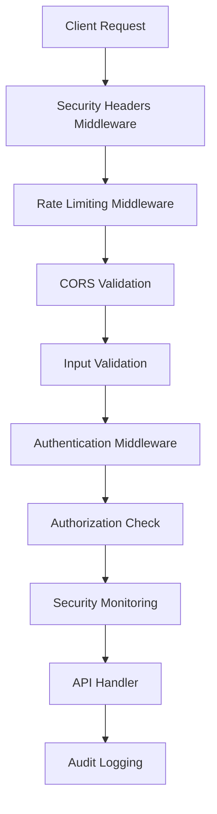

# Comprehensive Security Documentation

## Overview

This document provides comprehensive security guidelines, procedures, and incident response protocols for the Learning Assistant application. It covers all aspects of application security including authentication, authorization, input validation, monitoring, and incident response.

## Table of Contents

1. [Security Architecture](#security-architecture)
2. [Authentication and Authorization](#authentication-and-authorization)
3. [Input Validation and Sanitization](#input-validation-and-sanitization)
4. [Rate Limiting and DDoS Protection](#rate-limiting-and-ddos-protection)
5. [Security Headers and CORS](#security-headers-and-cors)
6. [Security Monitoring](#security-monitoring)
7. [Incident Response](#incident-response)
8. [Security Testing](#security-testing)
9. [Compliance and Auditing](#compliance-and-auditing)
10. [Security Best Practices](#security-best-practices)

## Security Architecture

### Multi-Layer Security Approach

The application implements a multi-layer security architecture:

1. **Network Layer**: Firewall, DDoS protection, IP filtering
2. **Transport Layer**: HTTPS/TLS encryption, HSTS
3. **Application Layer**: Authentication, authorization, input validation
4. **Data Layer**: Encryption at rest, secure database access
5. **Monitoring Layer**: Real-time threat detection, audit logging

### Security Components



### Key Security Modules

- **Enhanced Authentication Service** (`/src/lib/security/enhanced-auth.ts`)
- **Advanced Rate Limiter** (`/src/lib/security/advanced-rate-limiting.ts`)
- **Security Validator** (`/src/lib/validation/security-validation.ts`)
- **Security Headers Service** (`/src/lib/security/security-headers.ts`)
- **Security Monitor** (`/src/lib/security/security-monitor.ts`)

## Authentication and Authorization

### Authentication Flow

1. **User Login**: Credentials validated against user database
2. **MFA Verification**: Multi-factor authentication (when enabled)
3. **JWT Generation**: Secure token creation with appropriate claims
4. **Session Management**: Active session tracking and validation
5. **Token Refresh**: Secure token renewal process

### Authorization Model

#### Role-Based Access Control (RBAC)

```typescript
// Roles hierarchy
const roles = {
  guest: ['public:read', 'auth:login'],
  user: ['profile:*', 'learning:*', 'sessions:*'],
  premium_user: ['analytics:read', 'export:create'],
  moderator: ['content:moderate', 'reports:*'],
  admin: ['*:*'] // Full access
};
```

#### Permission System

- **Resource-based permissions**: Control access to specific resources
- **Action-based permissions**: Control specific actions (read, write, delete)
- **Conditional permissions**: Context-aware access control
- **Inheritance**: Role inheritance for permission management

### Security Features

- **Account Lockout**: Automatic lockout after failed attempts
- **Password Policy**: Strong password requirements
- **Session Security**: Secure session management
- **Device Fingerprinting**: Track and validate devices
- **Risk-based Authentication**: Adaptive security based on risk scores

### Implementation Example

```typescript
import { enhancedAuth } from '@/lib/security/enhanced-auth';

// Apply authentication middleware
export const GET = enhancedAuth.createAuthMiddleware(
  [{ resource: 'profile', action: 'read' }],
  {
    requireMFA: false,
    maxRiskScore: 70,
    requireTrustedDevice: false,
  }
);
```

## Input Validation and Sanitization

### Validation Layers

1. **Client-side Validation**: Basic validation for UX
2. **Server-side Validation**: Comprehensive security validation
3. **Database Validation**: Final data integrity checks

### Security Validator Features

- **XSS Protection**: Detects and prevents cross-site scripting
- **SQL Injection Prevention**: Identifies malicious SQL patterns
- **NoSQL Injection Protection**: Prevents NoSQL query manipulation
- **Path Traversal Detection**: Blocks directory traversal attempts
- **Command Injection Prevention**: Prevents system command execution
- **Input Sanitization**: Safe data transformation

### Usage Examples

```typescript
import { defaultSecurityValidator, createSecureStringSchema } from '@/lib/validation/security-validation';

// Basic validation
const result = defaultSecurityValidator.validateInput(userInput, 'string');
if (!result.isValid) {
  throw new Error(`Security violation: ${result.threats.join(', ')}`);
}

// Zod schema with security validation
const secureEmailSchema = createSecureStringSchema(100)
  .email('Invalid email format')
  .regex(/^[a-zA-Z0-9._%+-]+@[a-zA-Z0-9.-]+\.[a-zA-Z]{2,}$/, 'Invalid email pattern');
```

### Threat Detection Patterns

The security validator detects various attack patterns:

- **XSS**: `<script>`, `javascript:`, `on*=` events
- **SQL Injection**: `UNION`, `DROP`, `'OR'`, `; --`
- **NoSQL Injection**: `$where`, `$ne`, `$regex`
- **Path Traversal**: `../`, `%2e%2e`, `..\\`
- **Command Injection**: `|`, `;`, `&&`, `` ` ``

## Rate Limiting and DDoS Protection

### Advanced Rate Limiting

The application implements sophisticated rate limiting with:

- **IP-based limiting**: Requests per IP address
- **User-based limiting**: Requests per authenticated user
- **Endpoint-specific limits**: Different limits per API endpoint
- **Sliding window**: More accurate rate calculation
- **Burst protection**: Handle traffic spikes

### DDoS Protection Features

- **Traffic Pattern Analysis**: Detect abnormal request patterns
- **Behavioral Analysis**: Identify bot-like behavior
- **Geographic Filtering**: Block requests from specific regions
- **Adaptive Thresholds**: Dynamic limit adjustment
- **Automatic Mitigation**: Auto-block malicious sources

### Configuration Example

```typescript
import { defaultRateLimiter } from '@/lib/security/advanced-rate-limiting';

// Create endpoint-specific rate limiter
const authLimiter = defaultRateLimiter.middleware({
  maxRequestsPerUser: 10,
  maxRequestsPerIP: 5,
  windowMs: 60000, // 1 minute
});

// Apply to authentication endpoint
export const POST = async (request: NextRequest) => {
  const rateLimitResponse = authLimiter(request);
  if (rateLimitResponse) {
    return rateLimitResponse; // Rate limit exceeded
  }
  
  // Continue with authentication logic
};
```

### Monitoring and Alerts

- **Real-time Monitoring**: Track request patterns
- **Alert Generation**: Automatic alerts for suspicious activity
- **Statistics Tracking**: Comprehensive metrics collection
- **Whitelist/Blacklist Management**: IP reputation management

## Security Headers and CORS

### Security Headers Implementation

The application applies comprehensive security headers:

#### Content Security Policy (CSP)
```
Content-Security-Policy: default-src 'self'; script-src 'self' 'nonce-{random}'; style-src 'self' 'unsafe-inline' https://fonts.googleapis.com; img-src 'self' data: https:; connect-src 'self' https://api.openai.com
```

#### HTTP Strict Transport Security (HSTS)
```
Strict-Transport-Security: max-age=31536000; includeSubDomains; preload
```

#### Other Security Headers
- `X-Frame-Options: DENY`
- `X-Content-Type-Options: nosniff`
- `X-XSS-Protection: 1; mode=block`
- `Referrer-Policy: strict-origin-when-cross-origin`
- `Permissions-Policy: camera=(), microphone=(), geolocation=()`

### CORS Configuration

```typescript
cors: {
  allowedOrigins: ['https://yourdomain.com', 'https://app.yourdomain.com'],
  allowedMethods: ['GET', 'POST', 'PUT', 'DELETE', 'OPTIONS'],
  allowedHeaders: ['Content-Type', 'Authorization', 'X-Requested-With'],
  allowCredentials: true,
  maxAge: 86400
}
```

### Environment-Specific Configuration

- **Development**: Relaxed CORS, CSP in report-only mode
- **Production**: Strict CORS, enforced CSP, additional security headers
- **Testing**: Minimal restrictions for testing purposes

## Security Monitoring

### Real-time Monitoring

The security monitoring system provides:

- **Event Logging**: Comprehensive security event tracking
- **Threat Detection**: Real-time analysis of incoming requests
- **Pattern Recognition**: Identification of attack patterns
- **Anomaly Detection**: Statistical analysis for unusual behavior
- **Alert Generation**: Automatic alerts for security incidents

### Security Events

```typescript
enum SecurityEventType {
  AUTHENTICATION_SUCCESS = 'auth_success',
  AUTHENTICATION_FAILURE = 'auth_failure',
  AUTHORIZATION_DENIED = 'authz_denied',
  RATE_LIMIT_EXCEEDED = 'rate_limit_exceeded',
  SUSPICIOUS_ACTIVITY = 'suspicious_activity',
  XSS_ATTEMPT = 'xss_attempt',
  SQL_INJECTION_ATTEMPT = 'sql_injection_attempt',
  DDOS_ATTEMPT = 'ddos_attempt',
  // ... more event types
}
```

### Monitoring Dashboard

Access security metrics through the monitoring dashboard:

- **Event Timeline**: Chronological view of security events
- **Threat Analysis**: Risk assessment and threat classification
- **Performance Metrics**: Response times and error rates
- **Geographic Distribution**: Attack sources by location
- **Alert Management**: Review and respond to security alerts

### Integration Example

```typescript
import { securityMonitor } from '@/lib/security/security-monitor';

// Log security event
securityMonitor.logEvent(
  SecurityEventType.AUTHENTICATION_FAILURE,
  SecurityEventSeverity.HIGH,
  {
    ipAddress: '192.168.1.100',
    endpoint: '/api/auth/login',
    reason: 'invalid_credentials',
    riskScore: 75
  }
);

// Get security statistics
const stats = securityMonitor.getSecurityStatistics();
```

## Incident Response

### Incident Classification

#### Severity Levels

1. **Low**: Minor security events, automated handling
2. **Medium**: Suspicious activity requiring monitoring
3. **High**: Active threats requiring immediate attention
4. **Critical**: Confirmed attacks requiring emergency response

#### Incident Types

- **Data Breach**: Unauthorized data access or exfiltration
- **DDoS Attack**: Distributed denial of service attacks
- **Brute Force Attack**: Automated password cracking attempts
- **Injection Attack**: SQL, XSS, or other injection attempts
- **Privilege Escalation**: Unauthorized access level increases
- **Malware Detection**: Malicious code or files identified

### Response Procedures

#### Immediate Response (0-15 minutes)

1. **Detection**: Automated systems detect security incident
2. **Classification**: Determine incident severity and type
3. **Containment**: Implement immediate protective measures
4. **Notification**: Alert security team and stakeholders

#### Short-term Response (15 minutes - 4 hours)

1. **Investigation**: Analyze attack vectors and impact
2. **Mitigation**: Implement additional security measures
3. **Communication**: Update stakeholders on status
4. **Evidence Collection**: Preserve logs and forensic data

#### Long-term Response (4+ hours)

1. **Eradication**: Remove threats and vulnerabilities
2. **Recovery**: Restore normal operations safely
3. **Post-incident Analysis**: Conduct thorough review
4. **Improvement**: Update security measures and procedures

### Automated Response Actions

```typescript
// Automatic IP blocking for high-risk events
if (event.riskScore > 90) {
  rateLimiter.addToBlacklist(event.ipAddress);
  securityMonitor.createAlert({
    title: 'High-Risk IP Automatically Blocked',
    severity: SecurityEventSeverity.HIGH,
    recommendation: 'Review and confirm block status'
  });
}

// Account lockout for brute force attempts
if (failedAttempts >= 5) {
  authService.lockAccount(userId, 30 * 60 * 1000); // 30 minutes
  notificationService.sendAlert('Account locked due to suspicious activity');
}
```

### Communication Plan

#### Internal Communication

- **Security Team**: Immediate notification via Slack/Teams
- **Development Team**: Updates on security patches needed
- **Management**: Executive summary of incident impact
- **Legal Team**: Data breach and compliance implications

#### External Communication

- **Users**: Notification of security measures (if applicable)
- **Partners**: API security updates and requirements
- **Authorities**: Law enforcement reporting (if required)
- **Media**: Public statements (for major incidents)

### Documentation Requirements

- **Incident Timeline**: Detailed chronology of events
- **Impact Assessment**: Affected systems and data
- **Response Actions**: All mitigation steps taken
- **Lessons Learned**: Improvements and recommendations
- **Cost Analysis**: Financial impact and recovery costs

## Security Testing

### Automated Security Testing

The application includes comprehensive security tests:

```bash
# Run security test suite
npm run test:security

# Run specific security tests
npm test -- __tests__/security/security-test-suite.test.ts
```

### Test Categories

1. **Input Validation Tests**
   - XSS prevention testing
   - SQL injection detection
   - Path traversal protection
   - Command injection prevention

2. **Authentication Tests**
   - Token validation
   - Session security
   - Brute force protection
   - MFA verification

3. **Authorization Tests**
   - Role-based access control
   - Permission enforcement
   - Privilege escalation prevention

4. **Rate Limiting Tests**
   - IP-based limiting
   - User-based limiting
   - DDoS protection
   - Whitelist/blacklist functionality

5. **Security Headers Tests**
   - CSP enforcement
   - CORS validation
   - HSTS implementation
   - Other security headers

### Penetration Testing

#### Internal Testing

- **Quarterly**: Automated vulnerability scans
- **Monthly**: Manual security assessments
- **Weekly**: Security code reviews
- **Daily**: Automated security tests

#### External Testing

- **Annual**: Third-party penetration testing
- **Bi-annual**: Security architecture reviews
- **As-needed**: Incident-driven assessments

### Security Metrics

Track security effectiveness through metrics:

- **Vulnerability Count**: Open security issues
- **Time to Detection**: Average threat detection time
- **Time to Response**: Average incident response time
- **False Positive Rate**: Alert accuracy measurement
- **Security Score**: Overall security posture rating

## Compliance and Auditing

### Compliance Frameworks

The application addresses multiple compliance requirements:

#### GDPR (General Data Protection Regulation)
- **Data Minimization**: Collect only necessary data
- **Consent Management**: Clear consent mechanisms
- **Right to Erasure**: Data deletion capabilities
- **Data Portability**: Export user data functionality
- **Privacy by Design**: Built-in privacy protections

#### SOX (Sarbanes-Oxley Act)
- **Access Controls**: Strict authentication and authorization
- **Audit Trails**: Comprehensive activity logging
- **Data Integrity**: Prevention of unauthorized changes
- **Separation of Duties**: Role-based access controls

#### PCI DSS (Payment Card Industry Data Security Standard)
- **Secure Networks**: Firewall and encryption requirements
- **Cardholder Data Protection**: Encryption and access controls
- **Vulnerability Management**: Regular security testing
- **Access Controls**: Restricted data access
- **Monitoring**: Continuous security monitoring

### Audit Logging

All security-relevant activities are logged:

```typescript
interface AuditLogEntry {
  id: string;
  timestamp: Date;
  userId?: string;
  sessionId?: string;
  action: string;
  resource: string;
  ipAddress: string;
  userAgent: string;
  success: boolean;
  riskScore: number;
  metadata: Record<string, any>;
}
```

### Audit Procedures

#### Daily Audits
- Review security alerts and incidents
- Check system health and performance
- Validate backup integrity
- Monitor compliance metrics

#### Weekly Audits
- Analyze security trends and patterns
- Review access control changes
- Validate security configurations
- Update threat intelligence

#### Monthly Audits
- Comprehensive security assessment
- Compliance requirement review
- Security policy updates
- Staff security training

#### Annual Audits
- External security audits
- Compliance certification renewals
- Security architecture reviews
- Business continuity testing

## Security Best Practices

### Development Security

#### Secure Coding Guidelines

1. **Input Validation**
   - Validate all user inputs
   - Use parameterized queries
   - Implement proper encoding
   - Apply principle of least privilege

2. **Authentication Security**
   - Use strong password policies
   - Implement proper session management
   - Apply multi-factor authentication
   - Regular token rotation

3. **Error Handling**
   - Don't expose sensitive information
   - Log security events properly
   - Implement proper error responses
   - Use generic error messages

4. **Data Protection**
   - Encrypt sensitive data
   - Use secure communication channels
   - Implement proper access controls
   - Regular security updates

### Operational Security

#### Infrastructure Security

1. **Network Security**
   - Use firewalls and intrusion detection
   - Implement network segmentation
   - Monitor network traffic
   - Regular security patches

2. **Server Security**
   - Harden server configurations
   - Regular security updates
   - Monitor system logs
   - Implement backup procedures

3. **Database Security**
   - Use encryption at rest
   - Implement access controls
   - Regular security audits
   - Monitor database activity

### Security Training

#### Developer Training
- Secure coding practices
- OWASP Top 10 awareness
- Security testing methodologies
- Incident response procedures

#### User Security
- Password security awareness
- Phishing recognition
- Social engineering awareness
- Data protection practices

### Continuous Improvement

#### Security Metrics Review
- Monthly security scorecard
- Trend analysis and reporting
- Benchmark against industry standards
- Regular process improvements

#### Technology Updates
- Regular dependency updates
- Security patch management
- New threat intelligence integration
- Security tool evaluations

## Emergency Contacts

### Internal Contacts

- **Security Team Lead**: security-lead@company.com
- **DevOps Team**: devops@company.com
- **Legal Department**: legal@company.com
- **Executive Team**: executives@company.com

### External Contacts

- **Incident Response Partner**: [Partner Contact]
- **Legal Counsel**: [Legal Contact]
- **Insurance Provider**: [Insurance Contact]
- **Law Enforcement**: [Emergency Contact]

## Appendices

### A. Security Configuration Files

- `/src/lib/security/enhanced-auth.ts`
- `/src/lib/security/advanced-rate-limiting.ts`
- `/src/lib/validation/security-validation.ts`
- `/src/lib/security/security-headers.ts`
- `/src/lib/security/security-monitor.ts`

### B. Security Testing Scripts

- `__tests__/security/security-test-suite.test.ts`
- Security testing documentation
- Penetration testing procedures

### C. Compliance Documentation

- GDPR compliance checklist
- SOX compliance documentation
- PCI DSS requirements mapping
- Security audit reports

### D. Incident Response Templates

- Incident report template
- Communication templates
- Post-incident review template
- Lessons learned documentation

---

**Document Version**: 1.0  
**Last Updated**: {{ Current Date }}  
**Next Review**: {{ Next Review Date }}  
**Owner**: Security Team  
**Approved By**: {{ Approver Name }}

For questions or clarifications about this security documentation, please contact the security team at security@company.com.