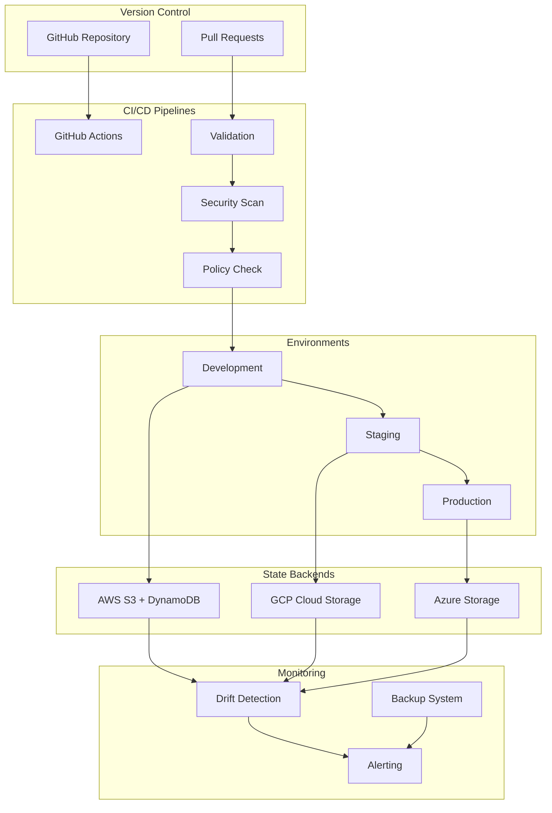
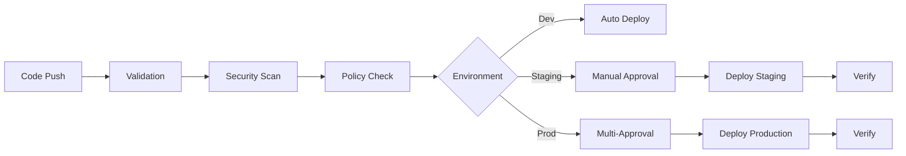
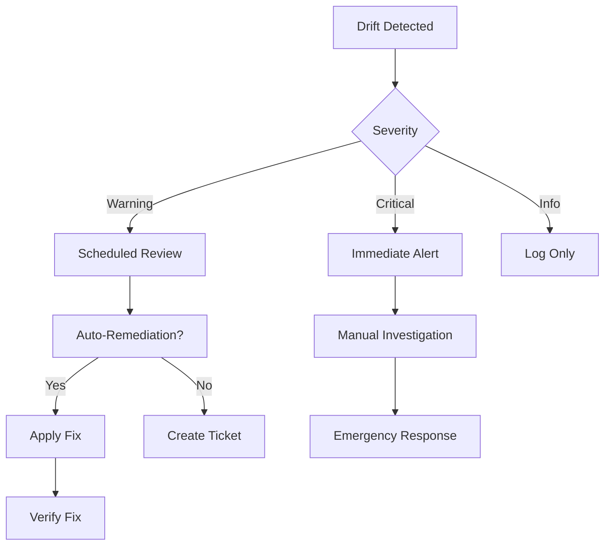

# Terraform State Management and Workflow Automation

This document provides comprehensive guidance on the Terraform state management and workflow automation system implemented for the Learning Assistant application.

## Table of Contents

1. [Overview](#overview)
2. [Architecture](#architecture)
3. [State Management](#state-management)
4. [Workspace Management](#workspace-management)
5. [CI/CD Pipelines](#cicd-pipelines)
6. [Policy Enforcement](#policy-enforcement)
7. [Backup and Recovery](#backup-and-recovery)
8. [Drift Detection](#drift-detection)
9. [Terraform Cloud Integration](#terraform-cloud-integration)
10. [Security](#security)
11. [Monitoring and Alerting](#monitoring-and-alerting)
12. [Troubleshooting](#troubleshooting)
13. [Best Practices](#best-practices)

## Overview

The Terraform state management system provides enterprise-grade infrastructure management with the following capabilities:

- **Multi-Cloud Support**: AWS, GCP, and Azure backends
- **Environment Isolation**: Separate workspaces for dev, staging, and production
- **Automated Workflows**: CI/CD pipelines with approval processes
- **Policy Enforcement**: Security and compliance validation
- **State Backup**: Automated backup and recovery procedures
- **Drift Detection**: Continuous monitoring for configuration drift
- **Enterprise Integration**: Terraform Cloud/Enterprise support

## Architecture



## State Management

### Remote State Backends

The system supports three cloud providers for remote state storage:

#### AWS S3 Backend

```hcl
terraform {
  backend "s3" {
    bucket         = "learning-assistant-terraform-state-prod"
    key            = "prod/terraform.tfstate"
    region         = "us-west-2"
    encrypt        = true
    dynamodb_table = "learning-assistant-terraform-state-lock-prod"
    kms_key_id     = "arn:aws:kms:us-west-2:123456789012:key/12345678-1234-1234-1234-123456789012"
  }
}
```

**Features:**
- S3 bucket with versioning enabled
- KMS encryption for state files
- DynamoDB table for state locking
- Cross-region replication for backups
- Access logging and monitoring

#### GCP Cloud Storage Backend

```hcl
terraform {
  backend "gcs" {
    bucket = "learning-assistant-terraform-state-prod"
    prefix = "prod/terraform/state"
  }
}
```

**Features:**
- Cloud Storage bucket with versioning
- Customer-managed encryption keys (CMEK)
- Cloud Firestore for state locking
- Cross-region backup buckets
- Audit logging with Cloud Logging

#### Azure Storage Backend

```hcl
terraform {
  backend "azurerm" {
    resource_group_name  = "learning-assistant-terraform-state-prod"
    storage_account_name = "learningassistanttfstateprod"
    container_name       = "tfstate"
    key                  = "prod/terraform.tfstate"
  }
}
```

**Features:**
- Storage account with blob versioning
- Azure Key Vault for encryption keys
- Storage account access policies
- Cross-region backup storage
- Azure Monitor integration

### State Security

All state backends implement enterprise security controls:

1. **Encryption at Rest**: State files encrypted with provider-managed or customer-managed keys
2. **Encryption in Transit**: HTTPS/TLS for all state operations
3. **Access Control**: IAM policies and RBAC for state access
4. **Audit Logging**: Complete audit trail of state operations
5. **Network Security**: Private endpoints and VPC/VNet restrictions

## Workspace Management

### Environment Isolation

Each environment operates in its own Terraform workspace:

- **Development** (`dev`): Auto-apply enabled, minimal approval requirements
- **Staging** (`staging`): Manual approval required, policy enforcement
- **Production** (`prod`): Strict approval process, comprehensive validation

### Workspace Configuration

```bash
# Initialize workspace
./infrastructure/state-management/scripts/workspace-init.sh dev

# Switch workspace
./infrastructure/state-management/scripts/workspace-switch.sh prod

# Validate workspace
./infrastructure/state-management/scripts/workspace-validate.sh staging
```

### Configuration Files

Environment-specific configurations are stored in:
```
terraform/environments/
├── development.tfvars
├── staging.tfvars
└── production.tfvars
```

## CI/CD Pipelines

### GitHub Actions Workflows

The system includes four main workflow files:

1. **terraform-aws.yml**: AWS infrastructure deployment
2. **terraform-gcp.yml**: GCP infrastructure deployment
3. **terraform-azure.yml**: Azure infrastructure deployment
4. **terraform-validate.yml**: Validation and testing

### Workflow Stages

#### 1. Validation Stage
- Terraform formatting check
- Configuration validation
- Syntax and structure verification

#### 2. Security Stage
- tfsec security scanning
- Checkov policy checking
- Custom security rules validation

#### 3. Policy Stage
- OPA/Sentinel policy evaluation
- Compliance checking
- Cost estimation

#### 4. Deployment Stage
- Environment-specific deployment
- Approval gates for staging/production
- Post-deployment verification

### Approval Process



## Policy Enforcement

### Policy as Code

The system implements policy enforcement using:

1. **Open Policy Agent (OPA)**: Cross-platform policy engine
2. **Sentinel**: HashiCorp's policy-as-code framework

### Policy Categories

#### Security Policies
- Encryption requirements
- Network security rules
- Access control validation
- Certificate management

#### Compliance Policies
- Required tags enforcement
- Cost control limits
- Regional restrictions
- Resource naming conventions

#### Operational Policies
- Backup requirements
- Monitoring configuration
- Lifecycle management
- Documentation standards

### Policy Implementation

```rego
# Example OPA policy
package terraform.policy

deny[msg] {
    resource := input.resource_changes[_]
    resource.type == "aws_s3_bucket"
    not resource.change.after.server_side_encryption_configuration
    msg := sprintf("S3 bucket '%s' must have server-side encryption enabled", [resource.name])
}
```

## Backup and Recovery

### Automated Backup System

The backup system provides comprehensive state protection:

#### Backup Script Usage
```bash
# Run backup for all environments
./infrastructure/state-management/scripts/state-backup.sh

# Backup specific environment
./infrastructure/state-management/scripts/state-backup.sh --environment prod

# Verify backup integrity
./infrastructure/state-management/scripts/state-backup.sh verify
```

#### Backup Features
- **Automated Scheduling**: Daily backups via cron/GitHub Actions
- **Cross-Region Replication**: Backups stored in multiple regions
- **Versioning**: Multiple backup versions with retention policies
- **Integrity Checking**: Checksum validation and corruption detection
- **Encryption**: Encrypted backup storage

#### Recovery Procedures

```bash
# List available backups
./infrastructure/state-management/scripts/state-migration.sh list --environment prod

# Restore from backup
./infrastructure/state-management/scripts/state-migration.sh rollback \
  --environment prod \
  --backup-timestamp 20240101_120000
```

## Drift Detection

### Automated Drift Detection

The drift detection system continuously monitors infrastructure for configuration drift:

#### Drift Detection Script
```bash
# Run drift detection
./infrastructure/state-management/scripts/drift-detection.sh

# Environment-specific detection
./infrastructure/state-management/scripts/drift-detection.sh --environment prod

# Enable auto-remediation
./infrastructure/state-management/scripts/drift-detection.sh --auto-remediate
```

#### Detection Features
- **Scheduled Scanning**: Configurable detection intervals
- **Multi-Environment**: Parallel scanning across environments
- **Severity Classification**: Critical vs. informational drift
- **Auto-Remediation**: Safe automatic fixes for approved changes
- **Reporting**: Detailed drift reports and notifications

#### Drift Response Process



## Terraform Cloud Integration

### Organization Setup

The Terraform Cloud integration provides:

1. **Workspace Management**: Automated workspace creation
2. **Team Access Control**: Role-based permissions
3. **Policy Sets**: Centralized policy management
4. **Variable Sets**: Shared configuration variables
5. **Run Triggers**: Workspace dependencies

### Configuration

```hcl
# Terraform Cloud workspace
resource "tfe_workspace" "prod" {
  name         = "learning-assistant-prod"
  organization = "learning-assistant-org"
  auto_apply   = false
  
  vcs_repo {
    identifier     = "org/learning-assistant"
    branch         = "main"
    oauth_token_id = var.vcs_oauth_token_id
  }
}
```

### Features

- **Remote Execution**: Runs execute in Terraform Cloud
- **State Management**: Centralized state storage
- **Policy Enforcement**: Built-in Sentinel policies
- **Cost Estimation**: Infracost integration
- **Team Collaboration**: Built-in approval workflows

## Security

### Access Control

#### IAM Policies
- **Principle of Least Privilege**: Minimal required permissions
- **Environment Separation**: Isolated access per environment
- **Time-Based Access**: Temporary credential rotation
- **Multi-Factor Authentication**: Required for production access

#### Secret Management
- **GitHub Secrets**: CI/CD pipeline credentials
- **Cloud Key Management**: Provider-native secret storage
- **Secret Rotation**: Automated credential rotation
- **Audit Logging**: Complete access audit trail

### Network Security

#### Private Endpoints
- **AWS**: VPC endpoints for S3 and DynamoDB
- **GCP**: Private Service Connect for Cloud Storage
- **Azure**: Private endpoints for Storage Accounts

#### Access Restrictions
- **IP Allowlisting**: Restricted access from known IPs
- **VPN Requirements**: VPN access for production
- **Service Accounts**: Dedicated service identities

## Monitoring and Alerting

### Metrics and Monitoring

#### Key Metrics
- **State Operation Success Rate**: Terraform command success/failure
- **Deployment Frequency**: Number of deployments per environment
- **Lead Time**: Time from commit to deployment
- **Mean Time to Recovery**: Recovery time from failures
- **Policy Violation Rate**: Policy compliance metrics

#### Monitoring Stack
- **GitHub Actions**: Workflow execution monitoring
- **Cloud Provider Monitoring**: Native monitoring services
- **Slack Integration**: Real-time notifications
- **Email Alerts**: Critical issue notifications

### Alerting Rules

#### Critical Alerts
- State file corruption or loss
- Failed production deployments
- Security policy violations
- Unexpected resource deletions

#### Warning Alerts
- Configuration drift detected
- Cost threshold exceeded
- Long-running operations
- Failed backup operations

## Troubleshooting

### Common Issues

#### State Lock Issues
```bash
# Check for existing locks
terraform force-unlock <lock-id>

# Verify lock status
terraform state show
```

#### Backend Configuration
```bash
# Reinitialize backend
terraform init -migrate-state

# Verify backend configuration
terraform init -backend-config=backend.hcl
```

#### Permission Issues
```bash
# Verify AWS credentials
aws sts get-caller-identity

# Check GCP permissions
gcloud auth list

# Validate Azure access
az account show
```

### Debug Mode

Enable debug logging for troubleshooting:
```bash
export TF_LOG=DEBUG
export TF_LOG_PATH=./terraform.log
terraform plan
```

### Support Contacts

- **Infrastructure Team**: infrastructure@company.com
- **Security Team**: security@company.com
- **On-Call**: oncall@company.com

## Best Practices

### Development Workflow

1. **Feature Branches**: Use feature branches for changes
2. **Pull Requests**: Require PR reviews for all changes
3. **Testing**: Validate changes in development first
4. **Documentation**: Update docs with infrastructure changes

### State Management

1. **Regular Backups**: Automated daily backups
2. **State Locking**: Always use state locking
3. **Workspace Isolation**: Separate workspaces per environment
4. **Version Control**: Track state file versions

### Security

1. **Credential Rotation**: Regular credential rotation
2. **Access Reviews**: Quarterly access reviews
3. **Encryption**: Encrypt all state files
4. **Audit Logs**: Monitor all state operations

### Monitoring

1. **Proactive Monitoring**: Set up alerts before issues
2. **Dashboard Creation**: Visual monitoring dashboards
3. **Regular Reviews**: Weekly infrastructure reviews
4. **Incident Response**: Documented response procedures

### Performance

1. **Parallel Execution**: Use parallelism where safe
2. **Resource Targeting**: Target specific resources when possible
3. **State Optimization**: Keep state files small and focused
4. **Provider Optimization**: Use latest provider versions

## Migration Guide

### From Local to Remote State

1. **Backup Local State**
   ```bash
   cp terraform.tfstate terraform.tfstate.backup
   ```

2. **Configure Backend**
   ```hcl
   terraform {
     backend "s3" {
       bucket = "your-state-bucket"
       key    = "terraform.tfstate"
       region = "us-west-2"
     }
   }
   ```

3. **Migrate State**
   ```bash
   terraform init -migrate-state
   ```

### Between Backends

Use the state migration script:
```bash
./infrastructure/state-management/scripts/state-migration.sh migrate \
  --environment prod \
  --source-backend local \
  --target-backend aws
```

## Appendix

### File Structure
```
infrastructure/state-management/
├── backend-aws.tf              # AWS S3 backend configuration
├── backend-gcp.tf              # GCP Cloud Storage backend
├── backend-azure.tf            # Azure Storage backend
├── workspaces.tf               # Workspace management
├── terraform-cloud.tf          # Terraform Cloud integration
├── policies/
│   ├── sentinel/               # Sentinel policies
│   └── opa/                    # OPA policies
├── scripts/
│   ├── state-backup.sh         # Backup automation
│   ├── drift-detection.sh      # Drift detection
│   └── state-migration.sh      # State migration
└── configs/                    # Environment configurations
```

### Environment Variables

Required environment variables for each provider:

#### AWS
```bash
export AWS_ACCESS_KEY_ID="your-access-key"
export AWS_SECRET_ACCESS_KEY="your-secret-key"
export AWS_REGION="us-west-2"
```

#### GCP
```bash
export GOOGLE_APPLICATION_CREDENTIALS="/path/to/service-account.json"
export GOOGLE_PROJECT="your-project-id"
export GOOGLE_REGION="us-central1"
```

#### Azure
```bash
export ARM_CLIENT_ID="your-client-id"
export ARM_CLIENT_SECRET="your-client-secret"
export ARM_TENANT_ID="your-tenant-id"
export ARM_SUBSCRIPTION_ID="your-subscription-id"
```

### Useful Commands

#### State Management
```bash
# List state resources
terraform state list

# Show resource details
terraform state show aws_instance.example

# Remove resource from state
terraform state rm aws_instance.example

# Import existing resource
terraform import aws_instance.example i-1234567890abcdef0
```

#### Workspace Management
```bash
# List workspaces
terraform workspace list

# Create workspace
terraform workspace new staging

# Switch workspace
terraform workspace select prod

# Delete workspace
terraform workspace delete dev
```

---

**Note**: This documentation is maintained by the Infrastructure Team. For questions or updates, please create an issue in the repository or contact the team directly.